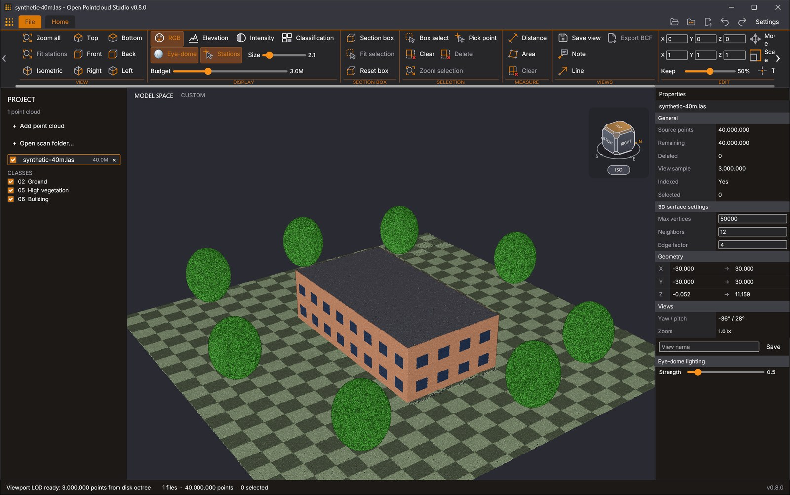
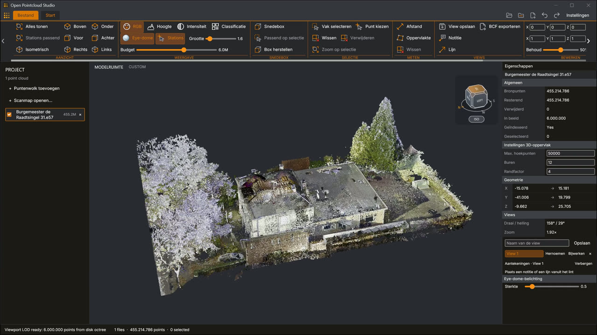

# Open Pointcloud Studio

A desktop application for viewing, measuring, editing and converting laser scans and other point clouds, and for turning them into section drawings, meshes and the flat faces of a building. It runs on Windows, Linux and macOS, is written in Rust and needs no browser or web view.

[](https://github.com/OpenAEC-Foundation/open-pointcloud-studio/releases/latest)
[](https://github.com/OpenAEC-Foundation/open-pointcloud-studio/actions/workflows/ci.yml)
[](#licences)



*One scan of 455 million points, six million of them on screen. The picture was taken with a build from before 0.8.0: the title bar does not yet show the file name and the version, and **Section drawing** is not yet in the SECTION BOX group. It shows the Dutch interface in one of the dark themes; a new installation starts in the light theme Blueprint Light, and **Settings** changes the language and the theme.*

[](docs/media/open-pointcloud-studio-teaser-en.mp4)

*The [teaser](docs/media/open-pointcloud-studio-teaser-en.mp4) (24 seconds, MP4, 34 MB) turns around the same office scan. It was recorded with 0.8.0, in the dark theme and before the ribbon and the panel at the left were rearranged.*

## Contents

- [Download and install](#download-and-install)
- [The first five minutes](#the-first-five-minutes)
- [What you can do](#what-you-can-do)
- [File formats](#file-formats)
- [Measured speed and limits](#measured-speed-and-limits)
- [Automation](#automation)
- [Build from source](#build-from-source)
- [Repository layout](#repository-layout)
- [Licences](#licences)
- [Contributing](#contributing)

The [user guide](docs/guide.md) describes every tool in detail. [CHANGELOG.md](CHANGELOG.md) lists what changed in each release.

## Download and install

The files are on the [releases page](https://github.com/OpenAEC-Foundation/open-pointcloud-studio/releases/latest). In the names below `VERSION` is the number of the release, for example `open-pointcloud-studio_0.9.1_x64-setup.exe`.

| System | File | What it is |
| --- | --- | --- |
| Windows 10 and 11, x64 | `open-pointcloud-studio_VERSION_x64-setup.exe` | Installer |
| | `open-pointcloud-studio_VERSION_windows-x64.zip` | The application with Open CAD Studio and the licence texts, without an installer |
| macOS 11 and later, Apple and Intel processors | `open-pointcloud-studio_VERSION_macos-universal.dmg` | Disk image with the application |
| | `open-pointcloud-studio_VERSION_macos-universal.tar.gz` | The bare binaries and the licence texts |
| Linux x86-64 | `open-pointcloud-studio_VERSION_amd64.deb` | Package for Debian, Ubuntu and their relatives |
| | `open-pointcloud-studio_VERSION_amd64.AppImage` | One file that runs on any distribution |
| | `open-pointcloud-studio_VERSION_linux-amd64.tar.gz` | The bare binaries and the licence texts |
| Linux 64-bit ARM (experimental) | `open-pointcloud-studio_VERSION_arm64.deb`, `_arm64.AppImage`, `_linux-arm64.tar.gz` | The same three kinds of file as for x86-64. Experimental: built and tested only on build machines with software rendering, not yet on real ARM boards or laptops |

Every package also carries [Open CAD Studio](https://github.com/HakanSeven12/OpenCADStudio), the open-source CAD application, which shows exported DXF and DWG drawings; it does not have to be installed separately. The release page also holds `open-cad-studio-source_SHORT.tar.gz`, the source it was built from, and `open-cad-studio-vendor_SHORT.tar.gz`, the crates it was built with from git repositories.

Every file has a `.sha256` file beside it; see [Checking a download](#checking-a-download).

### Windows

Run the installer. The release notes of each release say whether its Windows files carry a code signature. When they do not, Windows may warn about an unknown publisher ("Windows protected your PC") when you start the installer: choose **More info** and then **Run anyway**.

The installer asks for a language (English or Dutch) and installs for the current user without administrator rights, or for all users when you choose that in its first dialog. It adds a Start menu entry, a desktop icon if you tick that, and an uninstaller. It lists the application under "Open with" for E57, LAS, LAZ, PLY, PCD, PTX, PTS and XYZ files and scan project files (`.rcp`), without changing which program opens them by default.

The zip holds the same application: unpack it anywhere and start `open-pointcloud-studio.exe` in the folder it unpacks to. Without a code signature the same warning can appear the first time you start that file.

### macOS

Open the disk image and drag **Open Pointcloud Studio** onto the Applications folder. The application is one file for Apple and Intel processors. It is offered under "Open With" for E57, LAS, LAZ, PLY, PCD, PTX and PTS files and scan project files (`.rcp`), without changing which program opens them by default.

It is not signed with a paid developer certificate and not notarised, so macOS refuses to start it the first time. Allow it once:

- macOS 15 and later: start the application, close the message, open **System Settings > Privacy & Security**, scroll to **Security**, choose **Open Anyway** and confirm.
- macOS 11 to 14: Control-click the application, choose **Open** and confirm.
- Either version, from Terminal: `xattr -dr com.apple.quarantine "/Applications/Open Pointcloud Studio.app"`

The disk image carries the same note as `First start.txt`. The `.tar.gz` holds the binary and Open CAD Studio without the application bundle, and the licence texts, for use from a terminal.

### Linux

Linux needs a C library of version 2.35 or newer and the C++ runtime of GCC 12 or newer (`libstdc++.so.6` with `GLIBCXX_3.4.30`, which Open CAD Studio uses): Ubuntu 22.04, Debian 12, Fedora 36 or later have both. It also needs X11 or Wayland, and a Vulkan driver or OpenGL ES 3 through EGL. File dialogs use the desktop portal, or `zenity` where there is none.

The `.deb` installs the application as `/usr/bin/open-pointcloud-studio` with a menu entry, its icon and the libraries it needs, puts Open CAD Studio in `/usr/lib/open-pointcloud-studio`, and offers the application for E57, LAS, LAZ, PLY, PCD, PTX and PTS files and scan project files:

```bash
sudo apt install ./open-pointcloud-studio_0.9.1_amd64.deb
```

The AppImage needs no installation. Make it executable once and start it:

```bash
chmod +x open-pointcloud-studio_0.9.1_amd64.AppImage
./open-pointcloud-studio_0.9.1_amd64.AppImage
```

It mounts itself through FUSE (`fusermount3` or `fusermount`). Without FUSE, start it with `--appimage-extract-and-run` after the file name.

The `.tar.gz` holds the binary, Open CAD Studio beside it and the licence texts. It unpacks into a folder of its own name; run `./open-pointcloud-studio` in that folder.

### Checking a download

A `.sha256` file holds the SHA-256 checksum of the file it is named after. With both in the same folder:

```bash
sha256sum -c open-pointcloud-studio_0.9.1_amd64.deb.sha256              # Linux
shasum -a 256 -c open-pointcloud-studio_0.9.1_macos-universal.dmg.sha256  # macOS
```

```powershell
Get-FileHash open-pointcloud-studio_0.9.1_x64-setup.exe -Algorithm SHA256   # Windows
Get-Content open-pointcloud-studio_0.9.1_x64-setup.exe.sha256
```

On Linux and macOS the command answers `OK`. On Windows, compare the two outputs: the hash must be the same, apart from upper and lower case.

From the first release after 0.9.1, the Linux packages also carry a build attestation, kept by GitHub. With the [GitHub CLI](https://cli.github.com/), signed in with `gh auth login`, this checks that the release workflow of this repository attested the file and that it has not been changed since; the output names the tag the workflow ran for:

```bash
gh attestation verify FILE --repo OpenAEC-Foundation/open-pointcloud-studio   --signer-workflow OpenAEC-Foundation/open-pointcloud-studio/.github/workflows/release.yml
```

### Starting

Start the application from the Start menu, the Applications folder or the menu of your desktop.

From a terminal it takes the files to open as arguments. Only the `.deb` puts the executable on the search path; with the others, write its path in place of `open-pointcloud-studio` in the commands of this page:

| Installed from | Executable |
| --- | --- |
| Windows installer, current user | `%LOCALAPPDATA%\Programs\Open Pointcloud Studio\open-pointcloud-studio.exe`, unless you chose another folder |
| Windows installer, all users | `C:\Program Files\Open Pointcloud Studio\open-pointcloud-studio.exe`, unless you chose another folder |
| macOS disk image | `/Applications/Open Pointcloud Studio.app/Contents/MacOS/open-pointcloud-studio` |
| `.deb` | `open-pointcloud-studio` (installed as `/usr/bin/open-pointcloud-studio`) |
| AppImage | The AppImage file itself |
| zip or `.tar.gz` | `open-pointcloud-studio` (`.exe` on Windows) in the unpacked folder `open-pointcloud-studio_VERSION_...` |

```bash
open-pointcloud-studio scan.laz
open-pointcloud-studio /path/to/scan-folder
open-pointcloud-studio project.rcp
open-pointcloud-studio --help
```

## The first five minutes

The window has the **ribbon** with the tools along the top, the **project panel** with the open scans at the left, the **scene** (the 3D view) in the middle and the **Properties panel** (*Eigenschappen*) at the right. The ribbon is wider than the window at its first size: the arrow buttons at both ends of the ribbon, or the wheel over it, scroll to the groups that do not fit, among them EDIT (*BEWERKEN*), SURFACE (*OPPERVLAK*) and INDEX. **File** (*Bestand*) at the top left opens the File view, with the pages New, Open, Import and Export (*Nieuw*, *Openen*, *Importeren*, *Exporteren*) and the Workspace page (*Werkruimte*).

The interface follows the language of the system, English or Dutch; **Settings > General** (*Instellingen > Algemeen*) changes it. This page uses the English names and, in the steps below, gives the Dutch name in brackets where it differs.

1. **Open a scan.** Drop a file, a folder of scans or a scan project file (`.rcp`) on the window. Or choose **File > Import point cloud…** (*Bestand > Puntenwolk importeren…*) or **Open scan folder…** (*Scanmap openen…*). Without a scan of your own, take a public one: the table of data sets in [native/TEST_DATA.md](native/TEST_DATA.md) links public point clouds, from a room scan of 0.6 MB (PCD) to tiles of several hundred megabytes of the Dutch height model AHN6 (LAZ). While a file is read or indexed, a strip above the scene shows how far it is, with a button to cancel.

   With several scans open, one of them is the active scan: its row in the project panel has a coloured outline, and a click on a row makes that scan the active one. The section box and **Box select** (*Vak selecteren*) act on every visible scan. The tools that pick a point (measuring, notes and lines, and **Pick point**, *Punt kiezen*) and the exports of step 7 use the active scan only.

2. **Look around.** Drag with the middle button while Shift is held to orbit (or with the left button while Alt is held), with the middle or right button to pan, and turn the wheel to zoom at the pointer. The left button selects: a click picks a point, a drag draws a selection rectangle. Double-click a point to orbit about that point. `F` or **Zoom all** (*Alles tonen*) goes back to the isometric overview of the whole model. The cube in the corner turns the view to a face or a corner.
3. **Choose how points are shown.** In the **DISPLAY** group (*WEERGAVE*) of the ribbon, pick **RGB**, **Elevation** (*Hoogte*), **Intensity** (*Intensiteit*) or **Classification** (*Classificatie*), and set the point **Size** (*Grootte*) and the **Budget**: the most points drawn at once. A higher budget shows more detail and asks more of the graphics card.
4. **Cut a floor plan.** Switch on **Section box** (*Snedebox*). A box appears around the whole model, with a round handle in the middle of each face. Drag the handle of the top face down to about a metre above a floor, so that the box cuts through the walls. Then click the top face of the view cube (*BOVEN*) to look straight down. Seen from straight above, dragging the top handle has little or no effect; to change the height there, use the **Z max** slider under **Section box** in the Properties panel, or type the height as Z **Max** and choose **Apply XYZ limits** (*XYZ-grenzen toepassen*).
5. **Measure.** Choose **Distance** (*Afstand*) in the **MEASURE** group (*METEN*), click two points and press Enter. The length appears in the scene; the Properties panel also lists the horizontal length and the height difference.
6. **Save the view.** Choose **Save view** (*View opslaan*) under **VIEWS** in the Project Browser. The view is listed there under 3D views, after the 3D model; a click on its name brings back the camera, the section box while it was on, and the colour mode. **Create 2D plan / elevation / section…** (*2D-plattegrond / aanzicht / doorsnede maken…*) under it makes a plan, an elevation or a section, which VIEWS then lists under its kind and which opens as a tab beside **3D model** (*3D-model*) above the scene; click a tab to switch, × to close it. Click the outline of its crop region (*bijsnijgebied*) to select it, then drag its handles or type its figures in Properties to change what it shows; the drawing is made again from the points it already read. Copy it with **Duplicate** (*Dupliceren*) beside ×, and type **R** and then **O** to turn the crop region of a plan along the walls. With **Note** (*Notitie*), click a point, type a text and press Enter. **File → Export → Views as BCF…** (*Views als BCF…*) writes the views of the scan, with their notes and a picture each, as one `.bcf` file: the BIM Collaboration Format, an open format for passing viewpoints and remarks on a building between programs.
7. **Export what you cut.** Choose **File** and then **Export** (*Exporteren*), pick a **Format** (*Formaat*) under POINT CLOUD (*PUNTENWOLK*), then choose **Section box…** (*Snedebox…*). The file holds every point of the active scan inside the box, not only the points on screen. With several scans open, make each one active in turn and export it, or first join LAS and LAZ scans with **Merge visible LAS/LAZ scans…** (*Zichtbare LAS/LAZ-scans samenvoegen…*).

Three tools take the section box further. **Section drawing** (*Snedetekening*) in the SECTION BOX group saves the cut of step 4 as a 2D drawing in DXF or DWG, from all visible scans. With the box around one room, **Mesh Pointcloud** (*Puntenwolk meshen*) in the **SURFACE** group (*OPPERVLAK*) makes a **Closed mesh** (*Gesloten mesh*) of that room, or finds its **Flat faces** (*Vlakken*): its floor, ceiling, walls and round columns with their areas.

The source files are never changed: deleting, thinning, moving and scaling apply to the open view and to what you export.

## What you can do

The [user guide](docs/guide.md) has the detail of every heading below.

### Open

- Point clouds in LAS, LAZ, E57, PLY, PCD, PTX, PTS and text formats, meshes in OBJ, PLY, OFF and STL, and the points and faces of an ASCII DXF; see [File formats](#file-formats).
- A whole scan project at once: every supported file in a folder, or the scans that a scan project file (`.rcp`) lists and that lie beside it.
- Several files together, each as a layer that can be hidden, shown or closed; mark several layers with Shift-click and Ctrl-click to hide, show or close them together.
- Large files stay usable while they open: LAS and LAZ open from their header, an E57 file of 512 MiB or more first shows a sample spread through the file when its layout allows that, and a scan that is read in full shows its points while it is read, at every tenth of them, also when many scans are opened together.
- A strip above the scene shows the progress and the time left of each import and each index build, and the stages of a section drawing, a closed mesh and a face detection, with a button to cancel.

### View

- An index on disk (an octree) supplies the detail for the current camera, up to the point budget. It is built automatically for clouds of one million points or more, several at a time, and reused the next time the file is opened.
- The points on screen stay while the camera moves; the detail of the new view takes their place once it has been read.
- Four colour modes (stored colour, elevation, intensity, classification), eye-dome lighting, and a point size from 0.1 to 20.
- The classes that occur in the open clouds are listed in the project panel and can be shown or hidden one by one.
- A view cube, seven camera directions, **Zoom all** and a right-click menu in the scene.
- Tabs above the scene put the 3D model and the opened views and drawings side by side; Ctrl+Tab steps through them, the 3D model keeps its own camera and a drawing its zoom, and the window remembers which tabs were open.
- Scanner stations of E57, PCD and PTX scans are shown as markers. Stations with photos are drawn as balls: click one to stand in that station and look around.
- Panoramas and photos taken along a path in an E57 file are marked along their path. Double-click a mark, or a photo under its scan in the project panel, to stand where it was taken: the photo lies over the points, a **Photo** slider sets how much, `Page Up` and `Page Down` step along the path, and `Esc` returns. Measuring and picking work on the points under the photo.
- **Colour from photos** gives the points of a scan the colours its photos see them with, for a scan without colours or to replace them: only from photos that see a point unhidden, in the background, with Undo; exports write the new colours.
- Walk through the scene with `W`, `A`, `S`, `D`, down and up with `Q` and `E`, faster with Shift.

### Section box

- A box with six draggable faces limits what is shown, selected, meshed and searched for faces, and its content can be exported on its own or drawn as a [2D drawing](#section-drawing).
- Its limits can be typed as X, Y and Z coordinates in the Properties panel, fitted to the selection, or reset.
- The box can be turned about the vertical: type a **Rotation (°)** in Properties, or press **Align to walls** to turn it along the main direction of the walls inside it. Its faces, the cut planes of a [2D drawing](#section-drawing) and what it keeps then follow the walls of a building that stands at an angle to the axes of the scan.
- Where the box cuts a mesh, the cut looks solid: the material between two opposite faces of a wall, floor or ceiling, no farther apart than the **Max. wall thickness** (0.50 m by default), is filled on the faces of the box in one colour, as in a section drawing. A single surface, such as a facade scanned from one side, stays open. **Fill the cut**, **Max. wall thickness (m)** and **Cap colour** are under **Section box** in Properties.

### Select and edit

- **Box select** selects every source point inside a rectangle drawn on screen; **Pick point** selects the one point of the active scan under the pointer and shows its coordinates and attributes.
- **Delete** hides the selected points. Undo and Redo go back and forward through up to eight deletions.
- **Thin** reduces a cloud to an exact percentage of its points; **Move** and **Scale** shift and scale a cloud; **Reset transform** in Properties puts it back.
- None of this changes the source file. Exports write the edited result.

### Measure

- **Distance** measures a line through two or more picked points: each segment, the total length, the horizontal length and the height difference.
- **Area** measures a closed polygon: its area in its own plane (so a wall or a sloped roof is measured true), its area seen from above, and its perimeter.
- Points are picked from all points of the active scan, not only from the points on screen. A measurement is not saved with the scan.
- Lengths and areas are labelled in metres; the coordinates of the scan are taken as metres and are not converted.

### Views, annotations and BCF

- A saved view keeps the camera, the section box, the colour mode and its annotations, per scan.
- **Note** puts a text on a picked point; **Line** draws an arrow between two picked points.
- **Export BCF** writes all views of a scan as one BCF 2.1 file, each with its notes, camera, clipping planes and a picture of the scene.

### Export and convert

- Export the active scan: the whole cloud, the selected points, everything but the selected points, the section box, or every Nth point, as LAS, LAZ, E57, PLY, XYZ, PTS or CSV.
- An unedited LAS, LAZ or E57 file exported to its own format is copied byte for byte. LAS and LAZ exports keep the original point records with their attributes and coordinate grid; filtered E57 exports keep the scans and their scanner positions.
- **Merge visible LAS/LAZ scans…** joins the visible LAS and LAZ layers into one file.
- Every export reads the full source of that scan, so no point is lost to what the screen shows.

### Section drawing

- **Section drawing** in the SECTION BOX group makes a 2D drawing at scale 1:1 of what the section box cuts and saves it as DXF or DWG: a plan from the slab under the top face of the box, or a vertical section from the slab behind one of its four sides.
- While its block in Properties is open, the slab of the chosen view is outlined in blue in the scene, so that the cut plane of a vertical section is in sight. A slab of 0.10 m behind a face that lies outside the building holds no points; move that face onto a wall or make the slab thicker.
- In a box that is turned along the walls, the plan shows the walls along the axes of the drawing and the four sides are vertical sections parallel to the walls.
- The drawing holds the points of the slab, thinned to one per 5 mm, from every visible scan with its move and scale, without deleted points and hidden classes.
- **Filled cut** adds the walls, columns and floors that the slab goes through as filled regions with outlines, and leaves door and window openings open. **Preview** shows these regions over the points before a file is saved.
- The choices are millimetres or metres, model coordinates or the corner of the box as zero, a layer per scan or per class, layer colours or the colours of the scan, and the file versions R2004 to R2018.
- **Open in CAD viewer** shows the saved DXF or DWG file read-only in [Open CAD Studio](https://github.com/HakanSeven12/OpenCADStudio), the open-source CAD application that comes with the application, and **Open after export** does so after every export; the same holds for faces and meshes saved as DXF or DWG. Without it, as in a build from source that did not build it, the program chosen in Settings or an installed Open CAD Studio is used, and otherwise the program the system has for the file.
- The **Drawing view** shows the drawing in the application itself in place of the 3D scene as soon as it is exported, or after a preview, and whenever it is chosen under VIEWS in the Project Browser: points, filled cut, outlines, frame and text on a light sheet, with a switch per layer, pan and zoom, a scale bar and the coordinates under the pointer. Any DXF or DWG file opens there too, from **Open** in the File view.
- The filled cut is traced from the points and has limits: a wall scanned from one side is drawn as a thin strip, gaps under about half a metre are closed, and furniture in the slab is drawn unless its points are deleted first. The [user guide](docs/guide.md#the-filled-cut-and-its-limits) lists them.

### Mesh

**Mesh Pointcloud**, the one button of the SURFACE group, opens a card in three steps: the **method**, four cards that say what each makes and when to use it, with what it works on (the active scan, the section box and the selection, with about how many points); its **options**, each with its default and an explanation under the pointer, and **Use recommended**; and **Run**, with the progress, **Cancel**, and at the end the figures with **Show in model**, **Export…** and **Back to options**. A job goes on when the card is closed: the button then says which step runs and how far that step is, and opens the card on its Run step. Three of the methods turn the points of a scan, or the part of them inside the section box, into a mesh of triangles:

| Mesher | Use it for | What it gives |
| --- | --- | --- |
| **Terrain mesh** | Ground, and other surfaces seen from above | A 2.5D surface from the lowest points of a grid, without walls and overhangs |
| **3D surface** | A quick impression of a whole scan, walls and overhangs included | A surface from a sample of the points. It leaves holes and is not watertight |
| **Closed mesh** | A room or a part of a building of which the surface has to be right | A surface without overlaps from the region, closed wherever the scan has points or a gap narrower than the hole limit, with door and window openings left open; 100% of source points by default, or a deterministic smaller share for faster previews |

- **Terrain mesh** and **3D surface** take the active scan, save an OBJ file with colours and normals and show the result in the scene.
- **Closed mesh** takes the active scan, or every visible scan that reaches the section box (layers of 3D BAG buildings stay out): put the box around a room and choose **Run** in Mesh Pointcloud. Its options say beforehand which region will be meshed, how large it is and about how many triangles it gives, and warns when that is more than a mesh may hold, or comes close to it without simplification. The result becomes the mesh of the active scan.
- The settings of a closed mesh are the voxel size (automatic: 2 cm for a region up to 20 m), the widest gap that is closed (0.25 m), how far simplification may move the surface (automatic: 0.15 voxel; 0 for none), and how the front of a surface is found: from the scanner stations where the scan knows them, towards the centre of the region, or upward.
- A closed mesh measures its result: the Run step, Properties and the status bar give the mean, the 95% and the largest distance between the points and the mesh, and how much of the surface had no station to take its side from, with advice when that matters.
- A closed mesh has limits: corners are rounded by about a quarter of a voxel, objects thinner than two or three voxels merge or get holes, some gaps beside another surface stay open, and without stations a surface that the centre of the region sees edge on can come out torn. The [user guide](docs/guide.md#limits-of-a-closed-mesh) lists them, with what was measured on generated rooms; nothing was measured on a scan of a real building yet.
- A scan holds one mesh, which stays with the scan when it is moved or scaled. A new mesh takes the place of the previous one, and Undo does not apply to meshes.
- Properties shows the vertices and triangles of a mesh, its open edges (the rims of the surface and of its holes) and the number of connected parts.
- **Export mesh…** saves any mesh that is open, whether made here, opened from a file or downloaded from the 3D BAG, as OBJ, as binary PLY or as binary STL, and as editable 3D geometry for CAD and BIM programs: `MESH` entities in DXF or DWG, or an IFC4 element with a triangulated face set.

### Detected faces

- **Flat faces**, the fourth method of Mesh Pointcloud, finds the flat faces of a region (floors, ceilings, walls and sloped planes) and its round columns and pipes, in the active scan or in every visible scan that reaches the section box: put the box around a room and choose **Run** in Mesh Pointcloud. A flat face is one plane with its outline, in which a window is a hole and a door a notch; a column or pipe is one cylinder with its axis, radius and scanned length, without an outline. It is not a mesh of the surface; the [user guide](docs/guide.md#detected-faces) says how the two differ.
- The settings are the distance tolerance (20 mm), the angle tolerance (10°), the smallest face (0.25 m²), whether cylinders are looked for and which scans take part. The options say beforehand which region will be searched and which voxel size the working budget gives for it, and warns when the region is so large that narrow faces and faces close together will be lost.
- The faces are kept with the active scan as a layer of their own beside its mesh, with a **Faces** switch in the project panel, and stay with the scan when it is moved or scaled. They are drawn in one colour per face, or coloured by the deviation of the points with a legend in millimetres.
- The **Detected faces** section of Properties lists the faces with their type, their area and the residual of their points (RMS). A click on a row highlights that face in the scene and shows its normal, the 95th percentile and the largest deviation of its points and its coverage, and for a cylinder its diameter, its length and the arc that was scanned.
- **Export faces…** under Detected faces in Properties, **Export…** on the Run step of Mesh Pointcloud and **Detected faces…** in the File view save them as a JSON file with the parameters of every plane and cylinder, as an OBJ mesh with a group per face, or as 3D geometry for CAD and BIM programs, in the coordinates of the scene. In DXF and DWG every flat face is a polyface mesh that shows its outline and openings, on a layer per type, and every cylinder its scanned surface with its axis as a line. In IFC4 every face is a building element with its measured values: a flat face as a polygonal face set with its openings, a column as an extruded circle along its axis. No ACIS solids are written. They are not saved with the scan: export them to keep them.
- Faces are marked out of date when points of a scan that took part are deleted, restored or thinned, when the index such a scan was read through is replaced, when one is closed, and when one of several scans that took part is moved or scaled. **Clear faces** removes them.
- The detection has limits: strips narrower than 0.15 m such as door reveals are no faces, a region too large for the working budget is searched with larger voxels, thin scans give fewer faces or none, round columns wider than about 0.7 m come out as strips of wall, and the side a face looks at is a guess where the scan knows no stations. The [user guide](docs/guide.md#limits-of-detected-faces) lists them, with what was found on generated rooms; nothing was measured on a scan of a real building yet.

<!-- A new tool adds its bullet list here, as a "###" heading of its own, and a section in docs/guide.md. -->

### Other

- **3D BAG buildings…** in the File view downloads building models of the Netherlands for an area in RD New coordinates and shows them with a scan. It is a built-in extension that can be switched off on the Extensions page.
- **Settings** has the language (the language of the system, English or Dutch) and five colour themes.
- Display settings are kept between sessions. Settings and indexes are stored in the folders that the [user guide](docs/guide.md#where-settings-and-indexes-are-stored) names.

## File formats

| Format | Read | Write | Notes |
| --- | --- | --- | --- |
| LAS, LAZ | yes | yes | Opens from the header; exports keep the original point records |
| E57 | yes | yes | Scanner positions, station photos, panoramas (spherical and cylindrical) and photos taken along a path are read, with the coordinate system the file states, and can colour the points. A pinhole photo with a pixel size of zero gives its focal length in pixels |
| PLY | yes | yes | Reads ASCII and little-endian binary; writes either |
| PCD | yes | no | ASCII, binary and compressed binary |
| PTX | yes | no | With the scanner position of each scan |
| PTS | yes | yes | |
| XYZ, ASC, TXT, CSV | yes | XYZ, CSV | Text with one point per line |
| OBJ | yes | yes | Mesh with colours and normals; material colours are read, texture images are not. Detected faces are written as OBJ too, with one group per face |
| PLY as mesh | yes | yes | Shown as faces. Written as binary PLY with double coordinates, and with colours and normals where the mesh has them |
| STL | yes | yes | Shown as faces. Written as binary STL: triangles only, without colours. A mesh more than 2,048 m from zero is written relative to a whole-metre origin that the file header names |
| OFF | yes | no | Shown as faces; can be saved as OBJ, PLY, STL, DXF, DWG or IFC |
| DXF | yes | yes, as a drawing and as 3D geometry | Read: ASCII DXF only. POINT entities open as points, 3DFACE entities as faces that can be saved as a mesh; other entities are skipped. Written: the 2D drawing of a section box, with points, filled regions, outlines and a line of text; and in 3D, in metres, detected faces as polyface meshes and a mesh as `MESH` entities, without ACIS solids. Not a format of the point exports |
| DWG | no | yes, as a drawing and as 3D geometry | The 2D drawing of a section box, as for DXF, in the versions R2004 to R2018; detected faces and meshes in 3D as for DXF, in version R2013. DWG files are not opened |
| IFC4 (`.ifc`) | no | yes | Detected faces and meshes as building element proxies with their measured values: flat faces as polygonal face sets with their openings, columns as extruded circles, meshes as triangulated face sets. Coordinates far from zero are relative to a local origin that the site carries |
| Faces as JSON (`.json`) | no | yes | The detected faces of a scan: every plane and cylinder with its parameters and the residuals of its points, the outline of every plane, and the edges between flat faces. The [user guide](docs/guide.md#the-json-file) describes every field |
| BCF 2.1 (`.bcf`) | no | yes | Saved views with notes and pictures |
| PNG | no | yes | Picture of the 3D view, through the command API |
| Scan project file (`.rcp`) | yes | no | Only the list of scans is read. The indexed scan copies (`.rcs`) of a project are a closed format and are not read |

<!-- A new format of a new tool adds its row here. -->

## Measured speed and limits

These are measurements, each on the data named. The processor, memory and disk of the computer they were taken on were not recorded, so read the times as an order of magnitude and not as a benchmark. The rows of 3 October 2026 compare release builds for Windows; for the other rows the record does not name the system. [native/TEST_DATA.md](native/TEST_DATA.md) has the full record and says where the public data comes from.

| What | Data | Result | Date |
| --- | --- | --- | --- |
| Points on screen while the camera moves, at a budget of 6 million | Synthetic scene of 40 million points, LAS 1.2 with colours, 1.04 GB | Never fewer than 2.96 million; full detail of the new view after about 0.6 to 1.2 s, with the index in the file cache of the system | 3 Oct 2026 |
| Building the index | The same file | About 11 s | 3 Oct 2026 |
| Reading a whole file | Binary PLY of 3.2 GiB, 114,174,907 points, made from public AHN6 tiles | 18.13 s, 32,836 KiB peak memory | 1 Oct 2026 |
| Reopening that file with its index | The same file | 0.15 s, 18,712 KiB peak memory | 1 Oct 2026 |
| Selecting the points in a box of 100 by 100 by 100 m | The same file | 432,975 points in 0.56 s with the index; about 29 s without | 1 Oct 2026 |
| Reopening a text file with its index | XYZ of 2.58 GB, 45,839,678 points, from a public AHN6 tile | 0.10 s, 8,288 KiB peak memory | 2 Oct 2026 |
| Exporting a section with `--section` | Public AHN6 tile, LAZ, 45,839,678 points; 125,763 points written | 17.58 s, 148,976 KiB peak memory | not recorded |
| A budget of 10 million points | LAZ of 1.2 GB, 114,174,907 points, merged public AHN6 tiles | 5,451,630 points in view after about 4 s; about 641 MiB process memory | not recorded |

The section drawing, the closed mesh and the face detection were measured on generated rooms only; the [user guide](docs/guide.md) has those figures in the section of each tool.

Limits in the application:

| Limit | Value |
| --- | --- |
| Point budget | 250,000 by default; 100,000 to 10,000,000 on the ribbon, from 1,000 through the command API |
| Automatic index | For clouds of 1,000,000 points or more; can be switched off with **Auto-index** |
| Undo | 8 deletions |
| Saved views | 32 per scan, each with at most 64 annotations; a note has at most 240 characters |
| Measurement | 256 points |
| Section drawing | 150,000 points by default and at most 400,000; when the slab holds more after thinning to 5 mm, the point spacing doubles. Writing takes about 2.8 kB of memory per point: about 1.1 GB at 400,000 |
| Filled cut of a section drawing | A grid of at most 16 million cells: 80 by 80 m at the default cell of 20 mm, with larger cells beyond that. Gaps up to the largest wall thickness (0.50 m by default, at most 2 m) are closed |
| Mesh | 4,000,000 vertices and 8,000,000 triangles, for a mesh file and for a mesh job alike. Such a mesh takes about 0.25 GB of memory, 0.55 GB while it is shown, and up to 0.9 GB for a moment while a file of that size is opened |
| Meshes shown together | About 5.6 million vertices and 22 million triangles: what fits in the two buffers of 256 MiB each that the graphics card takes for them. One mesh always fits; one that does not fit beside the others is held, and can be saved, but is not drawn |
| Terrain mesh | 100,000 vertices |
| 3D surface | 3 to 1,000,000 vertices (50,000 by default), and an optional minimum mesh size |
| Closed mesh | Voxels of 0.005 to 0.5 m; 0.01 to 100% of the source points; gaps closed up to 3.2 m and at most 32 voxels; a scan without an index up to 5,000,000 points. About 2 GB of memory for the blocks in work |
| Detected faces | Distance tolerance 1 to 500 mm, angle tolerance 1 to 45°, smallest face 0.01 to 10,000 m². A working set of 1,500,000 voxels of 30 mm, beyond which the voxels double; at most 4,096 faces per job, of which Properties lists the 200 largest flat faces and the 200 largest cylinders; cylinders with a radius of 0.01 to 1 m |
| 3D BAG download | 2 by 2 km and about 5,000 buildings |

An index can take several gigabytes on disk for a large survey.

## Automation

### Command line

The first argument chooses a mode. Without one, the arguments are files, folders and scan project files to open in the window. The first two modes below open the window, `--mcp` runs until its input is closed, and the others do their work and end without a window.

| Mode | What it does |
| --- | --- |
| `open-pointcloud-studio [INPUT ...]` | Opens the window with the scans, scan folders and scan project files given |
| `--api-port PORT [INPUT ...]` | Opens the window with its command API on a fixed port |
| `--mcp` | Serves the commands as MCP tools on standard input and output, without a window of its own |
| `--list-scans PATH [PATH ...]` | Prints the scan files found in files, folders and scan project files |
| `--index INPUT` | Builds the index of a scan and keeps it for later |
| `--scans INPUT` | Prints the scanner positions stored in a scan |
| `--photos INPUT OUTPUT_DIRECTORY` | Saves the photos of a scan as image files |
| `--export INPUT OUTPUT` | Converts a scan; the extension of `OUTPUT` chooses the format (`.ply`, `.xyz`, `.pts`, `.csv`, `.las`, `.laz`, `.e57`) |
| `--section INPUT XMIN,YMIN,ZMIN,XMAX,YMAX,ZMAX OUTPUT [--rotation DEGREES]` | Exports the points of a scan that lie inside a box; with `--rotation` the box is turned that many degrees counter-clockwise about the vertical through its centre |
| `--drawing INPUT XMIN,YMIN,ZMIN,XMAX,YMAX,ZMAX OUTPUT.dxf\|.dwg [--view plan\|front\|back\|left\|right] [--rotation DEGREES] [--thickness METRES] [--units mm\|m] [--fill on\|off]` | Draws the slab behind one face of a box in a scan as a 2D drawing in DXF or DWG: a plan with a slab of 0.10 m in millimetres unless the options say otherwise |
| `--merge OUTPUT.laz INPUT1.las INPUT2.laz [...]` | Merges LAS and LAZ scans into one file |
| `--mesh INPUT OUTPUT.obj` | Writes a terrain mesh of a scan |
| `--surface INPUT OUTPUT.obj [--max-vertices N] [--neighbors N] [--edge-factor N] [--mesh-size SIZE]` | Writes a 3D surface mesh of a scan; reads the points from the index of the scan when it has one |
| `--closed-mesh INPUT OUTPUT.obj\|.ply\|.stl\|.dxf\|.dwg\|.ifc [--box XMIN,YMIN,ZMIN,XMAX,YMAX,ZMAX] [--rotation DEGREES] [--voxel METRES] [--max-hole METRES] [--simplify MILLIMETRES] [--sample-percent P] [--sides automatic\|centre\|upward]` | Writes a closed mesh of a scan, or of a box in it, as OBJ, PLY, STL, DXF, DWG or IFC; `P` selects a deterministic source share (100% by default) |
| `--faces INPUT OUTPUT.json\|.obj\|.dxf\|.dwg\|.ifc [--box XMIN,YMIN,ZMIN,XMAX,YMAX,ZMAX] [--rotation DEGREES] [--distance METRES] [--angle DEGREES] [--min-area SQUARE_METRES] [--cylinders on\|off]` | Detects the flat faces and the cylinders of a scan, or of a box in it, and writes them as JSON, OBJ, DXF, DWG or IFC: with a distance tolerance of 0.02 m, an angle tolerance of 10 degrees, faces from 0.25 m² and cylinders on unless the options say otherwise |
| `--survey INPUT OUTPUT.json` | Surveys a scanned building for Mesh to Plans and writes what was found as JSON: the box around the building without stray points far out, the main direction of its walls, its footprint, the occupied cells of 5 by 5 by 2 cm per height, and its levels: every floor with its ceiling, slab, slope and cut height, the roof, the ground and P |
| `--mesh-export INPUT OUTPUT` | Writes the faces of a mesh file as OBJ, PLY, STL, DXF, DWG or IFC; the extension of `OUTPUT` chooses the format (`.obj`, `.ply`, `.stl`, `.dxf`, `.dwg`, `.ifc`) |
| `--bag3d XMIN,YMIN,XMAX,YMAX 1.2\|1.3\|2.2 OUTPUT.obj` | Downloads the 3D BAG buildings inside an RD New box as OBJ |
| `--version`, `-V` | Prints the version |
| `--help`, `-h` | Prints the modes |

<!-- A test in native/desktop/src/cli_help.rs holds this table to the modes the application accepts. -->

```bash
open-pointcloud-studio --export scan.laz scan.e57
open-pointcloud-studio --section scan.laz 207440,474000,-100,208000,475000,1000 crop.laz
open-pointcloud-studio --merge merged.laz north.laz south.laz
open-pointcloud-studio --drawing scan.laz 0,0,0,20,15,1.1 plan.dxf
open-pointcloud-studio --drawing scan.laz 0,6,-1,20,15,8 section.dwg --view front --units m
open-pointcloud-studio --drawing scan.laz 0,6,-1,20,15,8 along-wall.dxf --view front --rotation 30
open-pointcloud-studio --closed-mesh scan.e57 room.ply --box 0,0,-0.1,5.1,4.1,2.7
open-pointcloud-studio --faces scan.e57 room-faces.json --box -0.1,-0.1,-0.1,5.1,4.1,2.7
```

### Command API

Every window runs a command server on `127.0.0.1`. It writes its port and a token to a discovery file: `instance-<pid>.json` in `%APPDATA%\open-pointcloud-studio-native\instances\` on Windows, and in `~/.config/open-pointcloud-studio-native/instances/` on Linux and macOS (or under `$XDG_CONFIG_HOME` when that is set). A command is one JSON object sent with that token:

```bash
curl -H 'Content-Type: application/json' -H 'X-OPS-Token: TOKEN' \
  -d '{"command":"status"}' http://127.0.0.1:PORT/exec
```

The commands open and close scans, set the camera, the section box and the display, select, delete, measure, save views, export, draw sections, mesh, detect faces, download 3D BAG buildings and take pictures of the 3D view. The server listens on the loopback address only and refuses a command without the token. [native/API.md](native/API.md) lists every command.

### MCP server

`open-pointcloud-studio --mcp` runs a [Model Context Protocol](https://modelcontextprotocol.io) server on standard input and output. It offers a tool for every command of the command API, tools that wait for long tasks, a screenshot tool that returns the 3D view as an image, and tools to list, choose and start windows. A client program starts it with a configuration like this one:

```json
{
  "mcpServers": {
    "open-pointcloud-studio": {
      "command": "/usr/bin/open-pointcloud-studio",
      "args": ["--mcp"]
    }
  }
}
```

`command` is the full path of the executable; see [Starting](#starting). [native/MCP.md](native/MCP.md) lists every tool.

## Build from source

You need the stable [Rust toolchain](https://rustup.rs). On Debian and Ubuntu, also install the development packages the window library links:

```bash
sudo apt-get install pkg-config libxkbcommon-dev libwayland-dev libx11-dev
```

Then:

```bash
cd native
cargo build --release -p open-pointcloud-studio-native
cargo test --workspace
cargo clippy --workspace --all-targets -- -D warnings
```

The executable is `native/target/release/open-pointcloud-studio`, with `.exe` on Windows. `cargo run -p open-pointcloud-studio-native -- scan.laz` builds and starts a development build with a file.

Open CAD Studio, which the packages carry, is not part of this repository. This script fetches the commit of its repository that `native/packaging/open-cad-studio.pin` names, checks that it is that commit, and builds it in a Cargo workspace of its own. It needs git and a C++ compiler besides Rust, and on Debian and Ubuntu also `libxcursor-dev libxi-dev libxrandr-dev libgl1-mesa-dev libfontconfig1-dev libfreetype6-dev`:

```bash
bash native/packaging/build-open-cad-studio.sh -j 4
```

It writes `native/target/open-cad-studio/release/OpenCADStudio`, where a development build of the application finds it. [native/README.md](native/README.md#open-cad-studio) says more.

[native/README.md](native/README.md) has notes for developers, and [native/packaging/README.md](native/packaging/README.md) describes how the installer and the packages are built and how a release is made.

## Repository layout

| Path | What it holds |
| --- | --- |
| `native/core` | The point-cloud library: readers and writers, the index on disk and the reads from it, export, meshing, 2D drawings, face detection and the 3D BAG client |
| `native/desktop` | The desktop application: window, 3D view, selection and the other tools, command API and MCP server |
| `native/assets` | Fonts, icons and the Dutch interface texts |
| `native/installer`, `native/packaging` | The Windows installer script and the packaging of all systems |
| `docs` | The user guide and its images |
| `screenshots` | Pictures taken while developing, most of them of earlier versions of the interface |
| `classic` | An earlier application, kept for reference and no longer developed |

## Licences

- The point-cloud library `native/core` is licensed under LGPL-3.0-or-later; see [LICENSE.md](LICENSE.md).
- The desktop application `native/desktop` is licensed under GPL-3.0-only; see [native/desktop/LICENSE-GPL-3.0](native/desktop/LICENSE-GPL-3.0). Its ribbon and properties rows are adapted from [OpenCADStudio](https://github.com/HakanSeven12/OpenCADStudio), which is GPL-3.0, and it uses that project's SVG icons.
- Open CAD Studio, which every package carries, is licensed under GPL-3.0 by its authors. Its source is not part of this repository: [native/packaging/open-cad-studio.pin](native/packaging/open-cad-studio.pin) names the commit of its repository that the packages are built from, and every release carries the source of that commit as `open-cad-studio-source_SHORT.tar.gz` and the crates it takes from git repositories, some of them under the MPL-2.0 or the LGPL-2.1-or-later, as `open-cad-studio-vendor_SHORT.tar.gz`. The packages carry its licence text as `OpenCADStudio-LICENSE.txt` and a notice with the commit as `OpenCADStudio-NOTICE.txt`.
- The fonts Inter and Space Grotesk are bundled under the SIL Open Font License 1.1; see [native/assets/fonts](native/assets/fonts/README.md).
- The Rust libraries the application links are recorded in `native/Cargo.lock`, each under its own licence; [native/NOTICE](native/NOTICE) has the third-party notices.
- Building models come from [3DBAG](https://docs.3dbag.nl/nl/copyright/) (CC BY 4.0), and the map in the 3D BAG panel from [Kadaster through PDOK](https://www.pdok.nl/copyright/) (CC BY 4.0). The application shows both credits, and files it saves from 3DBAG carry the credit.

Every package carries the licence texts.

## Contributing

- Report a problem or ask for a feature in the [issues](https://github.com/OpenAEC-Foundation/open-pointcloud-studio/issues). Say which system and version you use (the version is at the right end of the status bar and in **Settings > About**) and, if you can, which format the file has and how large it is.
- A pull request must pass `cargo test --workspace` and `cargo clippy --workspace --all-targets -- -D warnings`. The checks run them on Linux, Windows and macOS.
- Test data is generated by the tests or comes from public data sets; [native/TEST_DATA.md](native/TEST_DATA.md) lists the public ones. Do not add scans of real projects, or screenshots of them, to the repository. The picture at the top of this page is the one exception: it shows a scan of the maintainers' own building and was put there by them.
- A text of the interface is written in English in the source and looked up in `native/assets/locales/nl.json`. A new text needs an entry there; the tests fail when a text has no entry or an entry is no longer used.
- A new command-line mode is one entry in `native/desktop/src/cli_help.rs` and one row in the table above; a test holds the two to each other and to the code. A new command of the API gets a row in `native/API.md`, a tool, and the tool's row in `native/MCP.md`; a test fails when a row has no tool or when `MCP.md` and the tools differ, but not when a command has neither, so add all three together.
