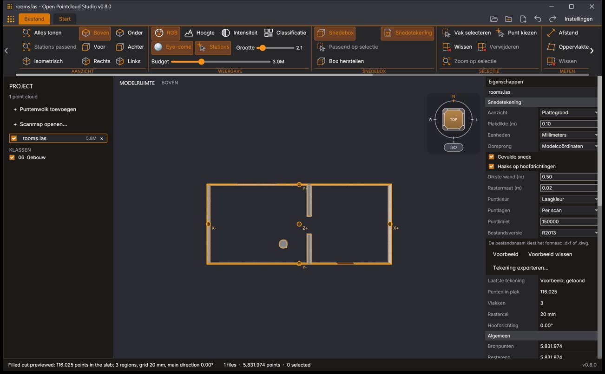

# User guide

How each part of Open Pointcloud Studio works. The [README](../README.md) has the installation, a first walk through the application and the file formats; this guide goes into each tool.

The interface is in English or Dutch. The guide uses the English names. Its pictures show the Dutch interface in one of the dark themes; a new installation starts in the light theme Blueprint Light, see [Settings, language and extensions](#settings-language-and-extensions).

## Contents

- [The window](#the-window)
- [Opening scans](#opening-scans)
- [Looking around](#looking-around)
- [Display](#display)
- [Scanner stations](#scanner-stations)
- [Station photos and walking](#station-photos-and-walking)
- [Section box](#section-box)
- [Selecting and editing](#selecting-and-editing)
- [Measuring distances and areas](#measuring-distances-and-areas)
- [Saved views, annotations and BCF](#saved-views-annotations-and-bcf)
- [Exporting and merging](#exporting-and-merging)
- [Section drawings](#section-drawings)
- [Meshing](#meshing)
- [Closed mesh](#closed-mesh)
- [Detected faces](#detected-faces)
- [Mesh to Plans](#mesh-to-plans)
- [Viewing a drawing in Open CAD Studio](#viewing-a-drawing-in-open-cad-studio)
- [3D BAG buildings](#3d-bag-buildings)
- [Index and level of detail](#index-and-level-of-detail)
- [Settings, language and extensions](#settings-language-and-extensions)
- [Where settings and indexes are stored](#where-settings-and-indexes-are-stored)
- [Keys and mouse](#keys-and-mouse)

<!-- A new tool gets a section of its own here and a line in the list above. -->

## The window

- The **top strip** starts with the application logo, the **File** button and the **Home** tab. At its right end are five quick-access buttons, shown as icons whose names appear when the pointer rests on them (Import point cloud, Open scan folder, Export active point cloud, Undo delete and Redo delete), and the **Settings** button. Actions that are not available are shown muted.
- The **ribbon** holds all tools on one row of groups: VIEW, DISPLAY, SECTION BOX, SELECTION, MEASURE, VIEWS, EDIT, SURFACE, MESH TO PLANS and INDEX. The ribbon is wider than the default window of 1440 pixels. The groups that do not fit scroll sideways, with the wheel, the scrollbar or the arrow buttons that appear at both ends; in a window wide enough for all groups the arrows go away.
- The **Project Browser** at the left has four groups, each under a band of its own colour with an icon, its name and a count: **SCANS**, **CLASSES**, **VIEWS** and **BCF**. A click on a band collapses the group or opens it again; the window remembers which groups are collapsed. Collapsing never closes or hides anything.
  - **SCANS** lists the open clouds in name order, one row each with a visibility switch, the icon of a scan, the point count and a button to close the cloud. A second line appears only while a cloud is loading or indexing, or when it has selected or deleted points. Its band shows how many scans are open and their points, a switch that shows or hides every scan (with a dash while only some are shown; a click on the dash shows them all), and buttons to add a point cloud and to open a scan folder. While scans open or index, a line under the band says how many are ready, with a thin bar, also while the group is collapsed. Scans from more than one folder are grouped per folder, each folder with its own band, switch and count.
  - **CLASSES** lists the classes that occur in the open clouds, each with a switch.
  - **VIEWS** holds everything that is a view, by kind: **3D views** with the 3D model first and then the saved views of the active scan, **Plans**, **Elevations** and **Sections** made with **Create 2D plan / elevation / section…**, and **Files**: the last preview, the exports and the DXF and DWG files opened in this session. A kind without anything in it is left out. A click on a row shows it, a view in the 3D scene and a drawing in the [Drawing view](#the-drawing-view), and the row of what is shown is highlighted. **3D model** shows the 3D scene as it is, without a saved view: the active view lets go of it, its annotations are hidden and the 3D model is the row highlighted. The cube on the band of VIEWS shows the 3D model, also while the group is collapsed. Under the rows are the name field with **Save view**, **Create 2D plan / elevation / section…** and **Open drawing…**.
  - **BCF** says what a BCF file of the active scan would hold, with **Export BCF**.
- The **scene** in the middle is the 3D view, with the view cube in a corner. A drawing chosen under VIEWS takes its place in the [Drawing view](#the-drawing-view); **3D model** brings the scene back.
- The **Properties panel** at the right shows what the active scan is and holds, and the settings that belong to what is in use: the camera, the current measurement, the selected point, the list of stations, the limits of the section box while it is on, the Drawing view block while that view is shown, the Section drawing, Closed mesh and Detect faces blocks while those tools are open, the strength of eye-dome lighting while that is on, the 3D surface settings, the size of the mesh of the active scan with its open edges and connected parts, and the progress of mesh, merge and scale jobs with their cancel buttons.
- The **status bar** at the bottom says what is going on, how many files and points are open and how many points are selected, and ends with the version.
- The **File view** opens with the File button and covers the ribbon and the scene. Its menu leads to the pages **New**, **Open**, **Import** and **Export**, then **Workspace**, **Extensions** and **About**, and ends with **Settings…**, **Return to model** and **Exit**. Each task is a tile that says what it writes or what it needs, and is greyed while it cannot run. **New** closes every open scan (the files are not changed); **Open** has **Point cloud…**, **Scan folder…** and **Drawing (DXF/DWG)…**, which shows a drawing file in the Drawing view; **Import** has **3D BAG buildings…**; **Export** groups the point cloud exports (with the format and the "every Nth point" step), the drawings and models, the BCF views and the merge. The Workspace page lists the open scans (click one to make it the active scan, the same as a click on its row in the project panel). Escape or Return to model closes the File view.

The title of the window is the file name of the active scan followed by the name and the version of the application, such as `rooms.las - Open Pointcloud Studio v0.9.1`; without a scan it is the name and the version alone.

In the project panel, click a row to make that scan the **active scan**; its row gets a coloured outline. The active scan is the one Properties describes, the one points are picked from (Pick point, Distance, Area and the annotation tools), the one Thin, Move, Scale and the meshers work on, and the one the exports and the saved views belong to. Shift-click marks every row from the active one up to the clicked one, and Ctrl-click (Command-click on macOS) adds or drops one row. The visibility switch and the close button of a marked row then act on all marked rows, so a set of scans can be hidden, shown or closed at once.

## Opening scans

A file opens in any of these ways:

- **Import point cloud…** in the File view, the Import point cloud icon in the top strip, or **+ Add point cloud** in the project panel.
- Dropping files, folders or scan project files on the window.
- Naming them on the command line: `open-pointcloud-studio scan.laz other.e57`.
- The `open` command of the [command API](../native/API.md).

Several files can be open at once. A scan that is already open or still loading is skipped.

### A whole scan project

A scan project is usually a folder with one scan file per station, often with a scan project file (`.rcp`) that lists them. Either opens in one step:

- **Open scan folder…** in the File view or the project panel, or a folder on the command line, opens every supported point-cloud or mesh file directly inside that folder. Sub-folders are not searched. The files are ordered by name with numbers compared as numbers, so `scan 2` comes before `scan 10`.
- A scan project file can be picked in the Import dialog or given on the command line. It is a ZIP container holding an XML document, and only that document is read. Every listed scan is looked up beside the project file, first by its stored relative path and then as `<scan name>.<extension>`, ignoring letter case. The absolute paths stored in a project belong to the computer that wrote it and are never used.

The status line reports how many scans are being opened and how many listed scans were not found, with the names of the first three, so it is clear which scans to put beside the project file. A folder and its project file together add every scan once.

A project file opens the scans it lists that exist beside it as E57, LAS, LAZ, PLY, PCD, PTX, PTS or text. The indexed scan copy (`.rcs`) that a project keeps of each scan, beside the project file or in its `<project name> Support` folder, is a closed format without a public specification and is not read. When a project has only those copies, the application says so instead of reporting missing scans: export the scans as E57, LAS or LAZ files named after the scans and put them beside the project file.

Folders and project files are read in the background, which keeps the window responsive on a network share. `open-pointcloud-studio --list-scans PATH [PATH ...]` prints the files that would be opened, one per line, without opening a window.

### What appears first

- **LAS and LAZ** open from their header at once, with a sample of points taken from places spread through the file.
- **Other formats** are read in full the first time, to learn the bounds and the number of points. While that runs, the scene shows the number of points read so far, and the import can be cancelled; a cancelled import adds nothing.
- **Points appear while a file is read.** A file that states how many points it holds, a million or more, shows its points at every tenth of them: an E57 scan, a PLY or PCD file, and a LAS or LAZ file that has to be read in full. Each time the scene gets an even sample of everything read so far, so a scan fills in step by step instead of appearing at the end, and its station marker is there from the start. A file of 64 MiB or more that states no count, such as PTX or a text file, gets its points every few seconds. When many scans are read side by side, their new points are shown together, a few times a second. The camera frames the scene once, when the first points appear, and then stays where it is. These points are provisional, as described under [Files of 512 MiB and more](#files-of-512-mib-and-more): when the reading ends, the complete cloud takes their place, and it is the same cloud as without them.
- A file that was indexed before reopens from its index without being read again; see [Index and level of detail](#index-and-level-of-detail).
- Up to 100,000 points of each file are kept in memory as its first picture. The detail beyond that comes from the index.

### Files of 512 MiB and more

A merged cloud of several gigabytes takes minutes to read in full, and a network share sets the pace.

An **E57 file** of that size first shows a preview of up to one million points taken from data packets spread evenly through the file. They are read on several threads while everything in between stays unread. Sampling stops after six seconds on a source that seeks slowly and shows the packets read by then, which are spread through the file as well. This needs record fields that all fill whole bytes and packets that all hold the same number of records, which merged clouds usually have. Station scans with a packed row and column index do not get this preview and show the points as they are read.

Any source of that size that is read in full (PLY, E57, PCD, PTX and the text formats) is shown while it is being read: every few seconds the scene gets the points known so far, which are the spread preview together with an even sample of up to two million points of what has been read. The scene can be turned, sectioned and measured in the meantime, and the camera stays where it was put. These clouds are provisional: they cannot be indexed, and they are closed again when the reading fails or is cancelled. When the reading ends the complete cloud takes their place, and keeps that sample so the scene does not thin out. At most two sources are shown this way at once; further ones are shown at every tenth of their points, as above.

### Progress

A strip above the scene has a line for every import that reads its source, for every index being built, and for a section drawing, a closed mesh or a face detection that is being made: the name of the scan, the step it is in, the points done of the total, a bar with the percentage, the time left at the pace so far and a button to cancel. An import that also builds an index reports two steps, reading and building; while it reads, also when its points are on view already, its **Cancel** stops the reading and closes the scan, and once it builds, its **Cancel** stops the index and keeps the scan open. Scans opened together share a line that says how many are done, with one button that cancels the rest. So do indexes, while more than one is built or waits: the line says how many are ready, how many are built at once and how many wait, and its button cancels them all.

The percentage needs a known total: an E57 file states its record count, and an index build knows the points of its cloud. Other formats show the points read so far without a bar. Each row of the project panel shows the percentage of its own scan with a thin bar underneath: reading, indexing, or "index queued" while it waits for its index. The status bar has a **Cancel import** button while an import runs.

## Looking around

- The left button selects: a click selects the point under the pointer and a drag draws a rectangle that selects the points inside it (see **Select** under Selecting).
- Drag with the middle button while Shift is held to orbit, or with the left button while Alt is held.
- Double-click a point to orbit about it: from then on the view turns about that point, which stays where it is on the screen, and a small target marks it while the view turns. Double-click where no point is drawn, or use Zoom all, to orbit about the centre of the model again. The view does not move when the point is set. While the section box is on and no point is set, the view turns about the centre of the box.
- Drag with the middle or the right button to pan.
- Turn the wheel to zoom at the pointer.
- `F` or **Zoom all** returns to the isometric overview of the whole model: it resets the direction, the zoom and the pan.
- The **VIEW** group has **Zoom all**, **Fit stations** and **Isometric**; the six directions are on the view cube.
- The **view cube** follows the camera. Click a face, a visible corner or its ISO button to turn the view; the zoom and the pan stay as they are.
- A right click without dragging opens a menu with Orbit, Box select, Pick point, Section box, Zoom all and Clear selection.

When a scan arrives, the scene is framed again unless the camera has been moved since the application last framed it; the first scan is always framed. Scans with stations are framed around their stations; without stations, a scene whose bounds are stretched by a few stray far points is framed around the bulk of its points.

Drags continue when the pointer leaves the scene. Survey coordinates such as national grid coordinates are handled in double precision, so points far from the origin stay sharp.

## Display

The **DISPLAY** group sets how points are drawn:

- **RGB**, **Elevation**, **Intensity** and **Classification** choose the colours. A cloud without stored colours or intensity is drawn in a neutral grey in those modes.
- **Eye-dome** switches eye-dome lighting on or off: a shading by depth that makes edges and relief visible. While it is on, Properties has its **Strength**, from 0 to 5.
- **Stations** shows or hides the station markers.
- **Size** sets the point size from 0.1 to 20.
- **Budget** sets the most points drawn at once, from 100,000 to 10,000,000. The budget is a ceiling: a view that needs fewer points gets fewer.

Points are drawn as small lit spheres. Close by they grow a little on screen so that their shading stays visible.

Under **CLASSES** the project panel lists the classification codes that occur in the open clouds, with the standard LAS names. Each can be shown or hidden like a layer. A hidden class is also left out of selections and meshes.

The choices of the DISPLAY group and the Auto-index switch are kept in `settings.json` and are in effect again at the next start. Invalid stored values fall back to the defaults. Which classes are hidden is not kept: every class is shown again at the next start.

## Scanner stations

The scan poses of E57 scans, valid `VIEWPOINT` headers of PCD files and the scanner positions of PTX files appear as station markers in the scene. A PCD header with an all-zero orientation opens with a neutral orientation and gets no marker with invented axes.

The only scan of an E57 file, when it has neither a scanner sweep (a row and column index or spherical coordinates) nor a name, is treated as a merged cloud: its pose places the points but shows no station marker.

- For a station on its own, small X, Y and Z axes show the registered orientation of the scanner.
- In a distant overview, stations that lie within 32 pixels of each other on screen share one marker with their number. Labels move around neighbouring markers. Zooming in separates the stations again.
- **Fit stations** in the VIEW group frames the stations together with the cloud.
- Properties shows the number of stations and of station photos under **Scan positions**; **Show list** lists every station with its coordinates and axis directions. Click a marker, or **Center** beside a station in that list, to pan the view to that position without changing its angle or zoom.

`open-pointcloud-studio --scans INPUT` prints the positions and orientations.

## Station photos and walking

E57 scans often carry the photos taken at each station as pinhole images, for example six cube faces of 90 degrees. They are listed from the file metadata when a scan opens; nothing is decoded until it is shown. Every station with photos is drawn as a ball that shows its surroundings, and stays visible through walls and roofs like the station markers.

Click a ball, or **Photo** beside a station in the list under **Scan positions**, to stand in that station: drag to look around, scroll to zoom, and click another station to step over to it. The photos are looked up per pixel in the image that sees each direction, so any set of pinhole photos with a pose works, not only complete cubes. Spherical and cylindrical photos are not shown.

`W`, `A`, `S` and `D` walk through the scene, `Q` and `E` move down and up, and Shift walks faster. Forward and back follow the viewing direction, so looking down a stairwell and pressing `W` goes down it; sideways stays level. While walking, points are drawn thicker and keep a size in the scene, so that surfaces close by fill in.

Walking starts from the current orbit view, or from inside a station. Walking out of a station leaves its photo and continues through the point cloud with the station behind you; walking into another ball enters its photo. Escape, **Back to 3D view**, Zoom all or a camera direction returns to the orbit view. The selection tools are not available while walking.

`open-pointcloud-studio --photos INPUT OUTPUT_DIRECTORY` saves the stored photos of every station and prints where each one looks.

## Section box

**Section box** in the SECTION BOX group switches on a box that clips what is shown: points and meshes outside it are not drawn.

- Drag one of the six handles on its faces to move that face.
- While the box is on, Properties has a **Section box** section with a slider for each of the six limits, **Min** and **Max** fields for X, Y and Z in model coordinates with **Apply XYZ limits**, and **Zoom box**, which frames the clipped volume.
- **Fit selection** fits the box around the selected points, using the selected source points themselves, also those that are not on screen.
- **Reset box** opens the box to the whole model again, keeping its rotation.
- The **turning handles**, curved arrows in the middle of the top edge of each side face, turn the box about the vertical line through its centre as the pointer goes round it.
- **Rotation (°)** turns the box about the vertical line through its centre, counter-clockwise as seen from above; type the angle and press Enter, or choose **Apply XYZ limits**. **Align to walls** turns it for you: it looks for the main direction of the walls in the middle half of the height of the box, as the filled cut of a plan does, and turns the box by at most 45 degrees so that its sides run along them. Put the box around a few walls first; with only the floor or ceiling in its middle, no walls are found and the box stays as it is.

The limits are coordinates in the model. They stay where they are when another layer is shown or hidden. In a turned box the **Min** and **Max** fields are the limits of the box before it is turned about its centre; the sliders and the handles move its faces along its own axes.

Where the box cuts a mesh, such as a closed mesh or a 3D surface, the cut looks solid: the material between the two faces of a wall, floor or ceiling is filled on the faces of the box in one colour, as the cut of a section drawing is, instead of showing the hollow between them. **Fill the cut** at the bottom of the **Section box** section switches this off and on (on by default). **Max. wall thickness (m)** below it is how far apart two faces may lie and still be filled, 0.50 m by default and at most 2 m, and **Cap colour** is the colour of the fill as `#rrggbb`, a dark grey (`#585858`) by default.

Only material between two faces that lie opposite each other, no farther apart than the maximum wall thickness, is filled. A single surface never is: a facade scanned from one side only, a loose sheet or the open edge where a mesh ends gets no fill, and neither does a solid block thicker than the maximum wall thickness. In a mesh made with stations every face looks at the side the scanner saw it from, so the two faces of a wall look away from each other, and two faces that look at each other hold the air between two walls. In a mesh made without stations the faces all look at the middle of the region instead, and one face of most walls looks the wrong way; the fill then counts the faces along the cut, from the open air outside to a room and on, as air and material take turns at every face. A third face that forms inside a thin wall in such a mesh is left out, and where a loose sheet stands close in front of a wall, neither the gap nor the wall behind it is filled. For a mesh of millions of triangles the fill takes about a second to appear after the box was moved; the cut is shown open meanwhile. The fill is kept with the other display settings.

The box also limits box selection, point picking, the three meshers and **Detect faces**. **Section box…** among the exports of the File view writes every source point of the active scan inside the box; see [Exporting and merging](#exporting-and-merging). **Section drawing** makes a 2D drawing of what the box cuts; see [Section drawings](#section-drawings).

A turned box clips the points, the exports, the selections, the meshers and **Detect faces** to what lies inside it, and a saved view and a BCF file keep its rotation. A view saved before boxes could turn has a box along the axes. The octree reads the part of the scan around the turned box, so a box turned 45 degrees reads somewhat more than one along the axes. Meshes and the faces found are clipped with the same box.

## Selecting and editing

### Selecting

- **Select** is the plain mouse, and what Escape returns to: a click selects the nearest point of the active scan within eight pixels, as Pick point does, a drag orbits and a double-click sets the orbit point. The button is lit while no other tool is on.
- **Box select**: draw a rectangle in the scene. Every source point of every visible scan inside it is selected, not only the points on screen. With an index the search visits only the parts of the index that the rectangle touches; without one it reads the whole source. While a search runs, **Cancel selection** takes the place of Zoom selection; a cancelled search leaves the previous selection as it was.
- **Pick point**: click a point. The nearest point of the active scan within eight pixels of the pointer is selected, and Properties shows its coordinates, colour, intensity and class under **Selected point**. While Pick point is on, the point under the pointer is picked when the left button is released, also after a drag. Orbit with Shift and a middle drag, and pan with a middle or right drag.
- **Clear** drops the selection. Escape leaves the active tool for Select and drops the selection as well.
- **Zoom selection** frames the selected points without changing the section box.

Selections honour the section box, the hidden classes and the points deleted before. For a very large selection the scene highlights a sample of the selected points; the count in Properties and in the status bar is the exact one.

### Editing

- **Delete**, or the Delete key, hides the selected points. **Undo** and **Redo** (the Undo delete and Redo delete icons in the top strip, Ctrl+Z and Ctrl+Y or Ctrl+Shift+Z; Command on macOS) restore and repeat up to eight deletions.
- **Thin** reduces the number of points: it keeps the percentage set with the **Keep** slider, from 1 to 100, of the points that remain, taken at even steps through the file, so every part of the scan thins by the same share. Keep 25 % removes three points in four. It counts as a deletion and can be undone. To write a reduced copy without thinning the open scan, use **Every Nth point…** among the exports.
- **Move** shifts the active scan by the X, Y and Z values typed beside it.
- **Scale** scales the active scan by the X, Y and Z factors typed beside it, around the centre of gravity of the points that remain. For a large cloud that centre is calculated in the background, with progress in Properties and a **Cancel** button in place of Scale.
- **Reset transform**, under **Live transform** in Properties, puts the cloud back at its source coordinates.

Every scan has its own deletions, and Thin, Move and Scale act on the active scan.

None of these change the source file. The scene, the section box, the station markers, selections, meshes and exports all use the edited cloud, and an export writes it to a new file.

## Measuring distances and areas

The MEASURE group has **Distance** and **Area**. In either mode a left click picks the source point under the pointer from the active scan, with the same search and eight-pixel reach as Pick point. A drag still orbits and pan and zoom work as usual, so the view can be turned between two points. Backspace removes the last point, Enter finishes the measurement, and Escape stops measuring and drops an unfinished measurement. In Area mode a click on the first point also finishes.

**Distance** measures a polyline: each segment shows its length, and the total 3D length, the horizontal length as seen from above and the height difference between the first and the last point are reported.

**Area** measures the closed polygon through the points: its true area, so a sloped roof or a vertical wall is measured in its own plane, the plan area as seen from above, and the perimeter. The area is the length of the polygon's vector area; for points that are not in one plane that is the largest area the polygon shows from any direction.

The measurement is drawn over the points with a label on every segment and one for the total or the area (a single segment carries one label), and it is listed under **Measure** in Properties. Values are shown with three decimals and the unit m (m² for areas). The application takes the coordinates of a scan as metres and does not convert them: a scan stored in another unit shows its own numbers under that label. A measurement keeps its scene coordinates and stays visible while walking; new points are picked in the orbit view. A finished measurement remains until **Clear** in the MEASURE group or the first point of the next one. Switching to a selection tool keeps a measurement that has enough points and drops one that has not. One measurement holds at most 256 points and is not saved with the scan.

## Saved views, annotations and BCF

### Views

A view holds everything needed to come back to it: the camera (the orbit camera, or the walking camera when the view was saved while walking), the section box with its limits in model coordinates and its turn when the box was on, the colour mode, the time it was saved, an identifier and its annotations.

**Save view** beside the name field under **VIEWS** in the Project Browser saves what the scene shows; it is the one button for views and section boxes alike. A view is of the 3D scene: when a drawing or the File view is in front, Save view shows the scene again and saves it as it is. Without a name the view becomes "View 1", "View 2", and so on. The Project Browser lists the views of the active scan under 3D views, after the 3D model; a view with a section box has a small box after its name. A click on a name restores the view. Every row has small buttons after the name: **Rename** changes its name, **Update** overwrites it with the current 3D view (showing the scene, as Save view does), **Duplicate** copies it and × deletes it; none of them restores the view first. A scan has at most 64 views, with names of at most 64 characters that are unique within it.

The small **Duplicate** button beside × on a row of VIEWS (every row but the files) makes a copy named after the original with " (2)", or the next free number, listed right below it and shown. The copy changes on its own: its camera, its section box and its crop region are its own. A copy of a drawing comes with the drawing as it is, without making it again. Duplicate on **3D model** saves the current 3D view, with the section box while it is on, as the view "3D model (2)".

Restoring puts the camera, the section box and the colour mode back, in the 3D scene also when a drawing was shown. A view with a section box switches the box on with its limits and its turn; a view without one switches the box off.

Section boxes that an earlier version saved under a name with **Save section** become views the first time this version starts: one view per box, named as the box and framing it, with the box switched on. Nothing of them is lost, and the file they were kept in, `section-boxes.json`, is left as it is. The orbit camera is relative to the bounds of the scene and to the size of the 3D view, so a view also keeps those: in a 3D view of another size the pan scales with the picture, and when other scans have been opened or closed since, the camera is moved to show what it showed.

Views are stored per source scan in `camera-views.json` in the settings folder. Every view in the file is read on its own, so a view that this version cannot read does not take the others with it, and a file that cannot be read at all is copied to `camera-views.unreadable.json` before the next save replaces it.

### Annotations

The view last saved or restored is the active view, shown highlighted in the list. Its annotations are drawn over the scene and stay on their points while the camera moves, in the orbit view and while walking; **Hide** stops showing them.

**Note** and **Line** in the VIEWS group place annotations by picking source points, with the same search and eight-pixel reach as the measuring tool; a drag still orbits.

- A note is a picked point with a text: after the click a field over the scene takes the text, and Enter or Add places a marker with a label and a leader.
- A line is two picked points, drawn as an arrow from the first to the second.

Escape cancels a half-placed annotation and, pressed again, leaves the tool. An annotation placed while no view is active first saves the current view. The annotations of the active view are listed under VIEWS in the Project Browser, each with × to delete it. A view holds at most 64, and a note at most 240 characters. The label of a note stays inside the scene and moves away from its point past the markers and the labels of other notes close by. The annotation tools, the measuring tools and the selection tools exclude each other. A half-placed annotation is dropped when another scan becomes the active one, and the tool is left when the last scan is closed.

### Snapshots

Each view has a snapshot: a PNG image of the scene alone, with the points, the section box and the annotations. It is taken shortly after a view is saved or updated and again when its annotations change, once the change has been drawn and the points have refined. Snapshots are stored as `view-snapshots/<identifier>.png` beside `camera-views.json`, at most 1920 pixels along their longest edge, and are removed with their view. When a snapshot cannot be taken the view is saved all the same.

A snapshot is only ever taken while the scene shows the view: the view is the active one, and the camera, the section box, the colour mode and the bounds of the scene are what they were when the view was last saved, updated or restored. The camera of a view does not follow the scene. After turning or zooming to reach a point, placing or removing an annotation changes the view and leaves its snapshot as it is; the status line says that the snapshot is renewed when the view is restored, and restoring the view takes it. The same goes for a snapshot that could not be taken, because the camera moved before it was or because capturing failed.

When only the size of the 3D view has changed, with the window or with a status text of more lines, the pan first follows the picture as it does on restoring, and the snapshot is taken of that. A snapshot taken in a 3D view of another size, or in a scene with other bounds, than the view was saved with stores the view relative to that size and scene, so that the picture and the camera of the view keep belonging together.

### BCF export

**Views as BCF…** on the Export page of the File view, or **Export BCF** under BCF in the Project Browser, writes all views of the active scan as one BCF 2.1 file (`.bcf`, the BIM Collaboration Format of buildingSMART). The file is a ZIP container with `bcf.version` and one folder per view, named by the view's identifier:

- `markup.bcf`: a topic with that identifier, the name of the view as its title, its creation date and the account name of the user as author, the file name of the scan in its header, and one comment per note, each referring to the viewpoint.
- `viewpoint.bcfv`: a perspective camera, the six clipping planes of the section box when it was on (each on a face, pointing at the side that is cut away), and lines: each line annotation, and a short upright line of 0.25 m at the point of each note.
- `snapshot.png`, when the view has a snapshot.

The status line reports how many views were written, how many of them with a snapshot, and how many changed after their snapshot was taken and wait to be restored. Coordinates are model coordinates in metres.

### How the exported camera relates to the view

The exported camera reproduces the view: it stands where the application's camera stands, with the true vertical field of view. The walking camera maps directly. The orbit camera stands 1.8 scene extents from the scene centre. Panning shifts its picture instead of turning it, which a BCF camera cannot express, so the exported camera is turned in place towards what is in the middle of the 3D view.

Without pan the two pictures are the same. With pan they agree in the middle and drift apart towards the edges, by about the distance from the middle squared times the pan, divided by the focal length squared, where the focal length is 1.25 times the shorter side of the 3D view divided by the zoom. In a view of 800 by 600 pixels at zoom 1, a pan of 50 pixels gives 0.7 pixels at 100 pixels from the middle, 3 at 200 and 14 at the left and right edges; a pan of 200 pixels gives 7 at 200 pixels from the middle and 46 to 59 at the edges. A view that must match its snapshot to the edge is saved without pan.

The BCF 2.1 schema limits `FieldOfView` to 45–60 degrees and announces that readers should expect values outside that range. The file states the true angle, which lies outside it for most views: the orbit camera at zoom 1 has about 44 degrees and narrows as it zooms in.

## Exporting and merging

The exports are in the File view under **EXPORT**. Each asks where to save and then runs in the background. The format is the one chosen under **EXPORT FORMAT** on the Workspace page: binary or ASCII PLY, LAS, LAZ, E57, XYZ, PTS or CSV.

| Entry | What it writes |
| --- | --- |
| **Full resolution…** | The active scan without its deleted points, moved and scaled as in the scene. The Export active point cloud icon in the top strip does the same |
| **Selected points…** | The selected points of the active scan |
| **Without selected points…** | The active scan without the selected and the deleted points |
| **Section box…** | The points of the active scan inside the section box; available while the box is on |
| **Section drawing…** | What the section box cuts as a 2D drawing in DXF or DWG, from every visible scan; available while the box is on. See [Section drawings](#section-drawings) |
| **Every Nth point…** | One point of the active scan in 2, 5, 10, 20, 50 or 100, as set under **EVERY NTH POINT** on the Workspace page |
| **Surface mesh…** | The mesh of the active scan as OBJ, PLY, STL, DXF, DWG or IFC; see [Saving a mesh](#saving-a-mesh) |
| **Detected faces…** | The faces detected in the active scan as JSON, OBJ, DXF, DWG or IFC; see [Saving the faces](#saving-the-faces) |
| **Views as BCF…** | The saved views of the active scan; see [BCF export](#bcf-export) |

Every export reads the source again from start to end, so points that are not on screen are written too. The file appears under its name only when it is complete. A section drawing has its own formats and reads only the slab it draws.

What an export keeps depends on the formats:

- **Same format, nothing edited**: an unedited LAS, LAZ or E57 cloud exported in full to its own format is a byte-for-byte copy.
- **LAS and LAZ to LAS or LAZ**: the original point records are written, with their point format, GPS time, return data, 16-bit colours, projection records and coordinate grid. Edits change only the fields they concern.
- **E57 to E57, filtered**: each source scan keeps its scanner pose, its name, its record types and values, and its custom fields. **Move** and a **Scale** with one positive factor for all three axes keep the scans when every scan has a pose.
- **Everything else**: position, 8-bit colour, intensity and class are written. A new E57 file made this way holds one scan in model coordinates; this writer has no class field for E57 and writes zero where a point has no colour or intensity.

**Merge visible LAS/LAZ scans…** joins the visible LAS and LAZ layers into one `.las` or `.laz` file in the background, with their deletions and their moves and scales applied and the original point attributes kept. The Workspace page shows the progress and a **Cancel merge** button; a cancelled merge leaves an existing file as it was. Sources with a different point layout, coordinate grid or coordinate system are refused before anything is written.

The command line does the same without a window: `--export`, `--section` and `--merge`; see the [README](../README.md#command-line).

## Section drawings



*The Section drawing block (Snedetekening) and the preview of the filled cut on a plan of two generated rooms, in the Dutch interface.*

**Section drawing** in the SECTION BOX group makes a 2D drawing at scale 1:1 of what the section box cuts, and saves it as DXF or DWG for a drawing program. The button needs the section box to be on. It opens the **Section drawing** block at the top of Properties, and closes it again. **Section drawing…** among the exports of the File view opens the block first when it is closed, so that the view can be chosen there; with the block open it asks for the file name at once, with the choices the block has.

While the block is open, the slab of the chosen view is outlined in blue in the scene, and the block says which face of the box is the cut plane. That face is easy to miss for a vertical section: with the box drawn around a whole building for a plan, its front face lies in front of the building, and a slab of 0.10 m there holds no points.

A section drawing is flat: it shows one slab of the building, and what it fills of a wall is traced from the points in that slab. For the floors, ceilings and walls of a room as planes in 3D, each with its area and with how far the points lie from it, use **Detect faces**; see [Detected faces](#detected-faces). Detected faces are saved as JSON, OBJ, or as 3D geometry in DXF, DWG and IFC (see [Saving the faces](#saving-the-faces)), and a section drawing does not use them.

### What is drawn

The cut plane is one face of the section box. The drawing holds the slab behind that face: everything between the face and a parallel plane a slab thickness deeper into the box.

| View | Cut plane | The viewer looks | Across and up in the drawing |
| --- | --- | --- | --- |
| **Plan** | The top face of the box | Down | X to the right, Y up |
| **Section, front** | The face at Y min | Along +Y | X to the right, Z up |
| **Section, back** | The face at Y max | Along -Y | X to the left, Z up |
| **Section, left** | The face at X min | Along +X | Y to the left, Z up |
| **Section, right** | The face at X max | Along -X | Y to the right, Z up |

In a turned box, X and Y in this table are the own axes of the box. A box turned along the walls of a building that stands at an angle to the model axes therefore gives a plan with the walls along the axes of the drawing, and the four vertical views are sections parallel to the walls. A plan of a turned box with **Model coordinates** has model X and Y turned with the box about the model origin; the line of text in the drawing gives the model position of drawing zero.

The drawing holds:

- **The points of the slab**, thinned to one point per 5 mm on the cut plane. They come from every visible scan, not only the active one, each where it stands in the scene after Move and Scale, without its deleted points and without the classes that are hidden. All source points in the slab take part, not only those on screen. A scan with an index is read only where the index touches the slab; a scan without one is read from start to end for every preview and every export. For the filled cut and for a preview, a box that holds stray points far from the building, so that the scans in it span more than the grid holds at the grid size asked, is read a second and at most a third time, to lay the grid over the surfaces alone. A scan that is still loading cannot be drawn: the status bar names it, and the drawing starts once it is loaded or hidden.
- **The filled cut**, when **Filled cut** is on: the walls, columns and floors that the slab goes through, as filled regions with a closed outline. See [The filled cut and its limits](#the-filled-cut-and-its-limits).
- **The frame**: the rectangle of the section box as the view sees it.
- **One line of text** under the frame: the view, where the cut plane lies, the slab thickness, the units and the model position of drawing zero.

### A plan, step by step

1. Open the scans of the storey and hide the layers that should stay out of the drawing.
2. Switch on **Section box**. Put its top face at the height of the cut: under **Section box** in Properties, type the height as Z **Max** and choose **Apply XYZ limits**. With a top face at 1.10 m above a floor that lies at zero and a slab of 0.10 m, the plan shows what lies between 1.00 and 1.10 m: above most furniture, through the doors and under the sills of most windows. Pull the four sides in to the part of the building that is wanted. Where the bottom face lies does not matter, as long as the box is deeper than the slab.
3. Choose **Section drawing**. Leave **View** on **Plan** and **Slab thickness (m)** on 0.10.
4. Choose **Preview**. The filled cut appears over the points on the cut plane; the top face of the view cube looks straight at it. Where a cupboard or a person shows up as a region, select those points with **Box select**, **Delete** them and preview again. **Clear preview** takes the preview away.
5. Choose **Export drawing…** and give a file name that ends in `.dxf` or `.dwg`. The strip above the scene shows the job with a **Cancel** button; a cancelled job leaves an existing file as it was. When the job is done, the status bar and the block say what was drawn.

### A vertical section, step by step

1. Switch on **Section box**. When the walls stand at an angle to the model axes, choose **Align to walls** first, or type the **Rotation (°)**, so that the sides of the box run along the walls. Then put one of its four sides where the cut should be. For a section that looks along +Y, that is the face at Y min: type the position as Y **Min** and choose **Apply XYZ limits**. Set the other faces around the part to draw, the top and bottom faces above the roof and under the floor.
2. Choose **Section drawing** and the **View** that stands at that face: **Section, front** for Y min, **back** for Y max, **left** for X min, **right** for X max.
3. Set **Slab thickness (m)**. With 0.10 the drawing shows only what the cut plane goes through. A thicker slab, up to 5 m, also shows what lies behind the cut, as an elevation does. The slab is never deeper than the box: in a box that is shallower than the thickness asked, the slab is the whole box, and the result says so.
4. A vertical section starts with **Filled cut** off: points only. Switch it on to get the floors and walls that are cut as filled regions.
5. Preview and export as for a plan. A front or side face of the view cube looks at the cut plane of a box along the axes.

The blue outline in the scene shows where the slab lies. When the job ends with "the slab holds no points", the face of the box that is the cut plane lies where there is nothing to cut, such as in front of the building: the message names the face. Move that face onto the walls, or make the slab thicker.

### The choices of a drawing

| Choice | What it does | Starts at |
| --- | --- | --- |
| **View** | The face of the box that is drawn. Choosing another view sets **Filled cut** on for a plan and off for a vertical section | Plan |
| **Slab thickness (m)** | Depth of the slab behind the cut plane, from 0.005 to 5 m; a comma or a point is read as the decimal mark | 0.10 |
| **Units** | **Millimetres** or **Metres**. The coordinates of the scans are taken as metres | Millimetres |
| **Origin** | **Model coordinates**: a plan keeps model X and Y, and a vertical section measures across from the left edge of the box as seen and keeps model Z, so levels read as heights. **Corner of the box**: the lower left corner of the view is zero | Model coordinates |
| **Filled cut** | Draws the cut material as filled regions with outlines | On for a plan |
| **Square to main directions** | Turns an edge of the filled cut onto the main direction of the building, or square to it, when that moves neither end of the edge more than 30 mm | On |
| **Largest wall (m)** | Two scanned faces at most this far apart are filled as one wall, above 0 and at most 2 m. Gaps up to this width are closed as well | 0.50 |
| **Grid size (m)** | The cell of the grid the filled cut is traced from, at least 0.005 m | 0.02 |
| **Point colour** | **Layer colour**, or **Scan colour (RGB)**: each point with the colour the scan stores for it | Layer colour |
| **Point layers** | **Per scan**: with several scans in the drawing, each gets a layer of its own. **Per class**: a layer per class | Per scan |
| **Point limit** | The most points in the drawing, at most 400,000. When thinning to 5 mm leaves more, the spacing doubles (to 10 mm, 20 mm and so on) until they fit | 150,000 |
| **File version** | R2004, R2010, R2013 or R2018, for DXF and DWG alike | R2013 |

The format is chosen by the file name: `.dxf` or `.dwg`. The choices hold for the session and are not kept between sessions.

With national grid coordinates, a drawing in millimetres has numbers of hundreds of millions, and some drawing programs draw less precisely that far from zero. **Corner of the box** keeps the numbers small; the line of text in the drawing gives the model position of drawing zero.

### Layers of the drawing

| Layer | What is on it |
| --- | --- |
| `OPS-POINTS` | The points. With several scans and **Per scan**: `OPS-POINTS-` followed by the file name of the scan without its extension, each in a colour of its own; the scans inside one multi-scan file share a layer, two scans with the same file name get `~2`, `~3` after the name, and a character a layer name cannot hold, such as `,` `;` or `=`, becomes `_`. With **Per class**: `OPS-POINTS-CLASS-02`, `-06` and so on, and `OPS-POINTS` for points without a class |
| `OPS-CUT-FILL` | The filled regions, as solid fills in grey |
| `OPS-CUT-OUTLINE` | A closed polyline around every region and around every hole in it |
| `OPS-FRAME` | The rectangle of the section box as the view sees it |
| `OPS-INFO` | The line of text |

A scan with no point in the slab gets no layer. Fills are written first, so that a drawing program draws them under the points and the outlines.

### What the result of a drawing says

When a job is done, the status bar says what was drawn, and the block keeps it under **Last drawing**:

- **Slab drawn**, only when the section box is shallower than the slab thickness asked: the depth that was drawn, which is the depth of the box. The status bar names both depths, and the line of text in the drawing gives the depth that was drawn.
- **Points in slab**: the source points that lie in the slab.
- **Points drawn** and **Point spacing**: the points in the drawing and the spacing they were thinned to. "(raised)" means the point limit made the spacing larger than 5 mm; the status bar names both spacings.
- **Regions**: the filled regions, and how many small ones were dropped because they are smaller than a wall of 50 mm by 0.30 m.
- **Grid cell**: the cell the filled cut was traced with. "(coarser)" means it is larger than the grid size asked for, because the points are too sparse for that cell or the surfaces in the slab span more than the grid holds.
- **Main direction**: the direction of the walls, in degrees from the X axis of the drawing, between -45 and 45. A vertical section always has zero, and a plan of a box turned along the walls about zero.
- The size of the file.

A slab without points gives no drawing: the job fails with "the slab holds no points", followed by the face of the box that is the cut plane, and nothing is written.

### The Drawing view

A drawing can be looked at in the application itself, without a drawing program. A drawing chosen under VIEWS in the Project Browser is shown in the main area in place of the 3D scene, on a light sheet; **3D model** under VIEWS, or the cube on its band, shows the scans in 3D again.

- **Create 2D plan / elevation / section…** under VIEWS opens a dialog: choose a plan, an elevation or a section, made from the whole 3D model, the section box or a saved view with a section box. From the model, a plan is cut at a height (1.20 m above the floor by default) and a section at a place along the axis it looks; an elevation takes the whole depth. The drawing is made from every visible scan with the other settings of the Section drawing block, shown in the Drawing view and listed under VIEWS as a plan, an elevation or a section. How it was made (its name, the box, the face, the slab, the settings and the scans) is kept in `drawings.json` beside the saved views, so it is listed again after a restart as soon as one of its scans is open; a click makes it again from its scans, which must then all be open. × forgets it.

- **After an export** the Drawing view opens with the drawing that was written, as long as **Show after export** is on in the Section drawing block; it is on in a new installation and kept for later sessions. **Show drawing** beside it opens the view at any time.
- **After a preview** the view holds the drawing an export with the same choices would write, made from the same read of the slab, but the window stays on the model. A preview therefore also collects the points of the drawing, and its result names them under **Points drawn**.
- **A DXF or DWG file**, made here or elsewhere, opens in the view with **Drawing (DXF/DWG)…** on the **Open** page of the File view, or with **Open drawing…** in the Drawing view block.

The drawing shows the points as dots, in their own colour or in that of their layer, the filled cut as filled regions with their holes, the outlines, the frame and the line of text. White and black are drawn black on the sheet, and colours too light to read on it a little darker. Drag with any mouse button to pan and turn the wheel to zoom about the pointer. The scale bar at the lower left gives a round length in the units of the drawing, and the lower right the coordinates under the pointer, in millimetres or metres as the drawing has them.

While the Drawing view is shown, the **Drawing view** block at the top of Properties says where the drawing came from, its units, and how many points, polylines, fills and texts it holds. **Zoom extents** fits the whole drawing on the sheet. Under **Layers** every layer has its colour, its number of entities and a switch; **Show all** and **Hide all** switch them together.

#### Crop region

A plan, an elevation or a section made with **Create 2D plan / elevation / section…** shows its **crop region** on the sheet: a thin blue rectangle with a small square handle in the middle of each side and at each corner. It is the face of the box the drawing was cut from, as the drawing shows it: for a plan the box along its own two horizontal axes, for an elevation or a section its width along the view and its height.

- **Drag a handle** to move that side, or the two sides at a corner. Over a handle the pointer shows arrows the way it moves; while dragging, the size is shown over the rectangle in metres, and the size goes in whole centimetres, never below 0.10 m. When you let go, the box of the drawing changes in the plane of the drawing only, and the drawing is made again under the same name, in place: the view keeps its zoom and position and the layers you switched off stay off. Making it again takes a moment on a large scan; when you choose the 3D model, a view, another drawing or the File view meanwhile, the window stays there, and the drawing is ready in place when you come back to it. The section box of the 3D view and the saved views are not changed.
- The **Crop region** switch below the layers hides the rectangle or shows it again. The crop region is never written into a DXF or DWG file.
- The **Crop region** section of Properties gives its figures: **Width (m)** and **Height (m)**, the centre (**Centre X** and **Centre Y** in model coordinates for a plan; **Centre along** and **Centre height** for an elevation or a section, the first measured along the box from the model origin), **Rotation (°)** for a plan, **Cut height** of a plan or **Cut position** of an elevation or a section, and **View depth (m)**: how deep the drawing sees behind the cut. Type a value and press Enter; the drawing is made again. Width and height change about the centre; a view depth deeper than the box makes the box deeper.

#### Turning the crop region with RO

Type **R** and then **O** (within a second and a half, while no text field has the focus; any other key in between, also Space, Enter, Tab, an arrow or Escape, starts over) to turn the crop region of the plan in the Drawing view. The rectangle turns about its centre with the pointer, in whole degrees, and in steps of 15° while Shift is held; the angle is shown beside the centre. Type a number (with a minus sign and a point or comma when needed) to set the angle exactly; Backspace takes back a digit. **Enter** or a left click applies the turn, **Escape** or a right click cancels it, and the status bar says what to do.

Applying turns the box of the plan about the vertical through the centre of the crop region, counter-clockwise seen from above when the rectangle was turned counter-clockwise on the sheet, and makes the plan again: the crop region stands upright again and the model is drawn turned the other way. Turn the rectangle along the walls of a building that stands at an angle, and the plan comes out with the walls along the sheet. Only the crop region of a plan turns; for an elevation or a section, RO says so in the status bar.

In the 3D view, RO turns the section box in the same way about its centre: the box follows the pointer, a typed number sets the angle, Enter or a click keeps it and Escape puts it back. While walking the pointer looks around, so type the angle; the status bar shows it. A section box set otherwise while it turns, by restoring a view, **Reset box** or **Apply XYZ limits**, ends the turn and stays as it was set. Without a section box the status bar says to switch it on.

What a file is read with:

- Points, lines, polylines with their arcs, circles, arcs, ellipses, solid fills with their holes, 2D solids, texts, multiline texts and the attributes of blocks are drawn. Block references are drawn with the blocks they insert, nested ones too; splines, leaders and dimensions as the lines they consist of. Curves become short straight segments.
- A fill with a pattern is drawn by its boundary only. Line types, line widths and the colours of single entities other than points are not drawn: every entity takes the colour of its layer.
- Other entities, such as images and external references, are counted by type and named in the block; meshes, polyface meshes, 3D faces and solids are counted as 3D content that is not shown. Neither stops the file from opening.
- Layers that the file has switched off or frozen start hidden.
- The units of the file are kept when they are millimetres; other units are shown in metres. A file that names no units is read as millimetres, and the block says so.
- The texts are placed by an estimate of their width, so a text that is centred or aligned right in a drawing program can stand a little off here.

### The filled cut and its limits

A scanner records surfaces, not what is behind them. A wall that the slab cuts is two rows of points, one for each face that was scanned. The filled cut closes the space between two such rows when they are at most the **Largest wall** apart, traces the outline of what results, and moves every edge onto the points it came from. Openings wider than that stay open, so doors and windows do.

Measured on generated rooms with a scanner noise of 2 mm, not on scans of real buildings: a face that was scanned on both sides of the wall is drawn within 10 mm of its points, and the jambs of doors and windows too. What the filled cut does not do:

- **A wall scanned from one side** has no thickness that can be measured. It is drawn as a strip of one grid cell (20 mm) on the points, not as a wall. The outer walls of an interior scan are of this kind. Such a face is drawn from a length of 0.30 m.
- **Gaps up to the largest wall thickness are closed**, in practice up to one or two cells more (0.52 to 0.54 m at the start values). A niche, a shaft or an opening narrower than about half a metre is filled, and an object of 0.15 m or more that stands that close to a wall becomes part of it. A closed door closes its opening.
- **Furniture and people stay.** Objects under 0.15 m across, such as chair legs and cables, are removed, regions smaller than 50 mm by 0.30 m are dropped and counted, and holes under 0.05 m² are filled. Anything larger in the slab is drawn as if it were a wall, unless its points are deleted first.
- **One main direction.** The gaps are closed along the main direction of the building and square to it. Walls at another angle are drawn as measured, but where a wing at another angle joins the main building, its inside corners are filled over up to about 0.5 m. A part that stands apart from everything else by more than the closing distance is traced in its own direction.
- **Squaring** turns an edge only when neither end moves more than 30 mm, so a wall of 5 m that is 2 degrees off stays as measured. Switch it off to keep every edge as measured.
- **Round columns and curved walls** are drawn as straight segments; with squaring on, corners can lie up to 50 mm outside a column of 0.30 m.
- **A shallow bump or recess**, under 30 mm deep, that returns to the face is not drawn.
- **Sparse points.** A cell counts from 3 points. For a sparse cloud the cells are doubled, at most twice (to 80 mm), and the accuracy falls to one cell; below 3 points per 80 mm cell nothing is drawn.
- **Large extents.** The grid has at most 16 million cells over the part of the cut plane where the scans have points: 80 by 80 m at 20 mm. A larger extent gets larger cells. Tracing a grid of that size takes about half a gigabyte of memory and a second or two.
- **A plan whose slab holds the floor** fills the floor: keep the slab above it.
- **In a vertical section** floors are taken as level. Walls are cut square only when the box is turned along them, as said above.

### Other limits of a section drawing

- **Points.** A drawing holds 150,000 points at the start and at most 400,000. While the file is written, every point takes about 2.8 kB of memory: about 0.4 GB at 150,000 points and 1.1 GB at 400,000. A dense underlay of millions of points is not what this drawing is for; export the section as a point cloud instead.
- **Opening the drawing here again.** To look at a drawing, use the [Drawing view](#the-drawing-view). Opened as a scan with **Point cloud…**, an ASCII DXF gives its POINT entities as a point cloud and skips fills, polylines and text, without applying the units of the drawing, so a drawing in millimetres comes back a thousand times larger than the scan. DWG files are not opened as a scan.
- **The preview** is drawn over the points without regard to depth, so it reads right when looking straight at the cut plane and only roughly from the side. It shows the filled cut whether **Filled cut** is on or off. It goes away when what it was made from changes: the section box, the visible scans, a Move or Scale, deleted points, the classes shown, or the view, slab thickness, squaring, largest wall or grid size of the block. The other choices of the block, the point limit among them, leave it in place. It is not kept with a saved view.
- **Checked with** the reader of the codec that writes the files and with this application's own DXF reader, not yet with a range of drawing programs. If a program refuses a DWG file, try DXF or another file version.
- One drawing or preview runs at a time, and Undo does not apply to it.

Without a window, `--drawing` draws a box of one scan file:

```bash
open-pointcloud-studio --drawing scan.laz 0,0,0,20,15,1.1 plan.dxf
open-pointcloud-studio --drawing scan.laz 0,6,-1,20,15,8 section.dwg --view front --thickness 0.1 --units m --fill on
open-pointcloud-studio --drawing scan.laz 0,6,-1,20,15,8 along-wall.dxf --view front --rotation 30
```

The six numbers are the section box: X, Y and Z min, then X, Y and Z max. `--rotation` turns it that many degrees counter-clockwise about the vertical through its centre. `--view` is `plan`, `front`, `back`, `left` or `right`, `--thickness` the slab in metres, `--units` `mm` or `m`, and `--fill` `on` or `off`; without them the drawing is a plan with a slab of 0.10 m in millimetres, filled for a plan and not for a vertical section. Limits that do not run from the minimum to the maximum and an output folder that does not exist are refused before the scan is read. The file is read through its index when `--index` or the window built one, and from start to end otherwise.

## Meshing

A point cloud becomes a mesh of triangles with one of the three meshers of the SURFACE group. The fourth tool of that group, **Detect faces**, does not make a mesh: it finds the planes and cylinders of a building; see [Detected faces](#detected-faces). All three use the points that remain inside the section box and whose class is visible, run in the background and then show the result in the scene as faces. One mesh job runs at a time.

| Mesher | Use it for | What it gives |
| --- | --- | --- |
| **Terrain mesh** | Ground, and other surfaces seen from above | A 2.5D surface of at most 100,000 vertices from one pass over the whole scan. No walls, no overhangs |
| **3D surface** | A quick impression of a whole scan, walls included | A surface from a sample of the points. It leaves holes, its patches can overlap and it is not watertight |
| **Closed mesh** | A room or a part of a building of which the surface has to be right | A surface without overlaps from the region, closed where the scan has points, with the measured distance between points and mesh. It uses every source point by default; a deterministic lower percentage trades detail for speed. It works best inside a section box; see [Closed mesh](#closed-mesh) |

**Terrain mesh** and **3D surface** take the active scan and ask for an `.obj` file first. Properties shows their progress; **Cancel mesh** stops the job and leaves an existing file as it was. A scan that is still loading gives no mesh yet: the status bar names it.

- **Terrain mesh** passes every source point through a grid seen from above, keeps the lowest point in each cell and connects those to a 2.5D surface of at most 100,000 vertices. Long edges across gaps are left out. It suits ground and other surfaces seen from above.
- **3D surface** takes a sample of the source, thins it evenly to the number of vertices asked for, estimates a normal at each and connects neighbours in their tangent planes. It can follow vertical walls and overhangs. Sparse parts leave holes, and neighbouring patches can disagree, so the result is not watertight. While a scan is active, Properties has its settings: **Max vertices** (3 to 1,000,000; 50,000 by default), **Neighbors** (3 to 32; 12 by default), a positive **Edge factor** (4 by default) and **Mesh size**: the width of a voxel in the units of the scan within which one point is kept before the vertices are thinned, so that no two vertices lie much closer together; 0, the default, leaves the spacing to the number of vertices. The points are chosen from the whole scan by a fixed rule on their place in the file, so the same scan gives the same surface every time. When the scan has an index, the points are read from the index instead of from the file, which saves decoding a large E57 once more, and the surface is the same.

The OBJ file has the colours of the source where it has them and a normal per vertex.

A scan holds one mesh: a new mesh takes the place of the previous one, and Undo does not apply to meshes. The project panel has a separate **Surface** switch per layer, so the points can be hidden while the faces stay.

OBJ, PLY, OFF and STL files open as meshes and are drawn as faces too, several at once. Of a DXF file, which must be an ASCII DXF, the POINT entities open as points and the 3DFACE entities as faces; other entities are skipped. Colours per vertex of OBJ and PLY are shown; OBJ files also get the diffuse colours of their material file. Texture images are not drawn. A mesh has at most 4,000,000 vertices and 8,000,000 triangles, whether it comes from a file or from a mesh job; a file with more is refused. A mesh at that limit takes about 0.25 GB of memory and 0.55 GB while it is shown, with about 0.3 GB more on the graphics card; a mesh file of that size takes up to 0.9 GB for a moment while it is opened. All meshes are drawn from one pair of buffers of the graphics card, which holds about 5.6 million vertices and 22 million triangles: one mesh always fits, and a mesh that no longer fits beside the others that are shown is held but not drawn, which Properties says under **Surface mesh**. Switch off the **Surface** of another layer to see it.

To reduce the number of points instead of making a mesh, use **Thin** in the EDIT group; see [Editing](#editing).

### What Properties says about a mesh

While the active scan holds a mesh, Properties has a **Surface mesh** section. The status bar gives the same figures when a mesh job ends.

- **Vertices** and **Triangles**: the size of the mesh.
- **Open edges**: the edges that belong to one triangle only. They are the outer rim of the surface and the rims of its holes. A closed surface has none. A terrain mesh always has its outer rim, and a 3D surface usually has many open edges, because it leaves holes where the points are sparse.
- **Connected parts**: the number of pieces that share no vertex with each other. One part is one continuous surface; a high number means loose patches.

A mesh file can hold the same corner more than once: one vertex per face, or one per material colour of an OBJ file. For a mesh that was opened from a file, vertices at exactly the same position therefore count as one for these two figures, so a closed surface shows no open edges however the file numbers its vertices, and the same mesh gives the same figures in every format. Parts that touch in such a position are one part, as buildings from 3D BAG that share a corner are. **Vertices** stays the number the mesh holds.

These figures say how the triangles hang together. They do not say how far the mesh lies from the points. Only a closed mesh measures that distance, and shows it in its own block.

### Saving a mesh

**Surface mesh…** in the File view, or **Export mesh…** under **Surface mesh** in Properties, saves the mesh of the active scan: a terrain mesh, a 3D surface, a closed mesh, the faces of an opened mesh file or downloaded 3D BAG buildings. The save dialog offers six formats, and the extension of the file name decides which one is written:

| Format | What the file holds |
| --- | --- |
| OBJ (`.obj`) | Text. Positions, and colours and normals per vertex where the mesh has them |
| PLY (`.ply`) | Binary. Positions as double-precision numbers, so survey coordinates keep all their digits, and colours and normals where the mesh has them |
| STL (`.stl`) | Binary. Triangles only: no colours, and 32-bit numbers |
| DXF (`.dxf`), DWG (`.dwg`) | For a CAD program: the triangles as `MESH` entities on the layer `OPS-MESH`, in metres and in version R2013, with double-precision coordinates. A `MESH` entity holds at most 65,536 triangles and 65,536 corners here, so a larger mesh becomes several. A mesh with colours is split by colour: every triangle takes the mean colour of its corners, the colours are reduced to a palette of at most 256, and each palette colour becomes its own entities in that true colour, still on `OPS-MESH`. A corner on the border of two colours is in the entities of both, so such a file is larger than one of the same mesh without colours |
| IFC (`.ifc`) | For a BIM program: IFC4 with a project, site, building and storey, and the mesh as one building element proxy with a triangulated face set, marked closed when every edge has two triangles. A mesh with colours has a colour per triangle (`IfcIndexedColourMap`) from the same palette of at most 256 colours; the grey surface style stays as the colour for a program that does not read colour maps. See [The CAD and IFC files](#the-cad-and-ifc-files) for where coordinates far from zero go |

The mesh is written as the scene shows it, with the move and scale of its scan applied. A scan that is mirrored by a negative scale factor keeps its outside in the file: the corners of the triangles are written in reverse order and the normals point outward. The file appears under its name only when it is complete. The source file of the scan cannot be chosen as the destination.

An STL file stores 32-bit numbers, which hold about seven digits. Up to 2,048 m from zero that is a quarter of a millimetre or better. A mesh that lies farther away on an axis, as a scan in RD New does, is therefore written relative to an origin in whole metres on that axis. The status bar names the origin, and the file states it in its 80-byte header as `origin X Y Z m`. Open Pointcloud Studio adds it again when it opens the file, so the mesh returns to its place. Another program does not read the header and shows the mesh near zero: add the origin there, or choose OBJ or PLY when the coordinates have to stay as they are.

An OBJ or PLY file of 3D BAG buildings carries the credit of the register in its first lines, in plain ASCII in a PLY file. Open Pointcloud Studio reads it there when the file is opened again, so the scene shows the credit and a further export keeps it. An STL file has no room for the credit; name the source yourself when you pass such a file on.

Without a window: `--mesh`, `--surface` and `--closed-mesh` make a mesh, and `--mesh-export INPUT OUTPUT` writes the faces of any mesh file as OBJ, PLY, STL, DXF, DWG or IFC by the extension of `OUTPUT`.

## Closed mesh


*A closed mesh of two generated rooms with its report in the Closed mesh block (Gesloten mesh), in the Dutch interface.*

**Closed mesh** in the SURFACE group makes a surface of the points in a region that has no overlapping faces and is closed wherever the scan has points or a gap narrower than the hole limit. It is the mesher for a room or a part of a building of which the result has to be right: by default it uses every point of the region, tells how far the points lie from the mesh, and leaves door and window openings open. A lower **Source points (%)** setting uses a reproducible subset to reduce fitting work, with a possible loss of sparse detail. The button opens the **Closed mesh** block at the top of Properties, and closes it again.

The table under [Meshing](#meshing) sets it beside **Terrain mesh** and **3D surface** and says when to use which; [What Properties says about a mesh](#what-properties-says-about-a-mesh) and [Saving a mesh](#saving-a-mesh) hold for a closed mesh as for the other two. For the planes of a building instead of its surface, see [Detected faces](#detected-faces).

### How it works, in short

The points are reduced, per cell of half a voxel, to small pieces of surface with a direction. Around them the distance to the surface is worked out at the corners of a grid of voxels: positive on the side the scanner saw, negative behind the surface. Scanner noise averages out in that distance. Near an edge, where pieces of two faces are within reach, the distance is measured to the plane of each face and not to a mean of the two, so that the edge lies where the two planes cross. The surface is where the distance is zero, and it is taken out of the grid with a vertex in every voxel it passes through, which puts the vertices on the edges and corners between walls, floors and steps. Where the points end, the surface ends too, a little past the last points, and that end is a rim of open edges. A gap in the points that is narrower than the hole limit is closed with the surface the points around it predict. The region is cut into blocks of 96 voxels that are meshed side by side and join without a seam. Flat parts are then simplified to a few large triangles.

### One room, step by step

1. Open the scan or the scans of the room and wait until they are indexed; the strip above the scene shows that. A scan of one million points or more gets its index by itself. A scan without an index is read into memory for the job when it has at most 5,000,000 points; a larger one is refused until **Build index** in the INDEX group has run.
2. Switch on **Section box** and put it around the room: click the top face of the view cube and bring the four sides to the middle of the walls around the room, so that the faces of the walls on the room side lie inside the box and those of the rooms next door do not. Put the top face just above the ceiling and the bottom face just under the floor. The mesh is made of what lies inside the box.
3. Choose **Closed mesh**. Under the settings the block says what a job would mesh: the active scan or the visible scans, inside the section box or as a whole, the size of that region in metres, the voxel that will be used, and about how many triangles the faces of that box give before simplification. Furniture and inner walls add to that number. When the region is too large for the limits of a mesh, or may be, the block says so in the accent colour before anything is started. With simplification the warning comes when the faces of the box alone give more triangles than a mesh holds, and the job then fits only when simplification takes most of them away. Without simplification (**Simplify within** at 0) it comes from about two thirds of the limit, because a scanned surface has more triangles than the faces of its box: a generated room with a noise of 2 mm, a column and the reveals of a door and a window gave about 1.4 times as many.
4. When the room was scanned from several stations that are separate files, set **Scans** to **All visible scans** and hide the layers that should stay out. With the section box on, only the visible layers that reach the box take part: a layer that lies outside it is not read and does not count for the size of the region. Layers of 3D BAG buildings are left out. The mesh goes to the active scan either way, so make one of the scans the active layer first: a layer of 3D BAG buildings does not take a mesh of the scans, and the block says so.
5. Choose **Start**. The strip above the scene shows the job step by step, with a **Cancel** button: reading (only for a scan without an index), finding the blocks that hold points, meshing block after block, simplifying across the blocks, and measuring the result. A cancelled job leaves the mesh the scan had as it was.
6. When the job is done the mesh is shown as the mesh of the active scan, and the status bar and the block give its figures. Hide the points of the layer in the project panel to look at the mesh alone; the **Surface** switch of the layer hides the mesh.
7. The mesh exists in this session only. **Export mesh…** under **Surface mesh** in Properties, or **Surface mesh…** in the File view, saves it as OBJ, PLY, STL, DXF, DWG or IFC; see [Saving a mesh](#saving-a-mesh).

A scan holds one mesh. The closed mesh takes the place of the mesh the active scan had, whichever mesher made it, and Undo does not bring that one back. The mesh is kept in the frame of its scan: **Move** and **Scale** afterwards take the mesh along with the points.

### The settings of a closed mesh

| Setting | What it does | Starts at |
| --- | --- | --- |
| **Voxel size (m)** | The edge of a voxel, from 0.005 to 0.5 m. Smaller voxels follow more detail and cost more time and triangles. Empty, or `auto`, lets the job choose: 0.02 m for a region up to 20 m long, 0.03 m up to 60 m and 0.05 m beyond | Empty (automatic) |
| **Close holes up to (m)** | Gaps in the points up to this wide are closed, from 0 (none) to 3.2 m, and never more than 32 voxels: 0.64 m at voxels of 0.02 m. Wider openings, such as doors and windows, stay open as a whole | 0.25 |
| **Simplify within (mm)** | How far simplification may move the surface, from 0 (no simplification) to 1000 mm. Empty, or `auto`, is 0.15 voxel: 3 mm at voxels of 0.02 m | Empty (automatic) |
| **Source points (%)** | The share of the source points the surface is fitted to, from 0.01 to 100: the same points on every run, spread over the whole region. 10 uses about one point in ten and is faster, but sparse detail may be lost. A share that leaves no point in the region stops the job with a message to raise it | 100 |
| **Sides** | Which side of a surface is its front. **Automatic**: the side of the scanner station that measured it, where the scan knows its stations; elsewhere the side of the centre of the region. **Towards the centre**: every face looks at the centre of the region, and stations are not used. **Upward**: every face looks up, for data measured from above | Automatic |
| **Scans** | **Active scan**, or **All visible scans**: every layer whose points are shown and that reaches the section box when the box is on, without layers of 3D BAG buildings | Active scan |

A comma or a point is read as the decimal mark. The centre of the region is the middle of the section box after it has been cut back to where the scans have points, so a box drawn wide around a room still has its centre in the room. The settings hold for the session and are not kept between sessions. Deleted points and hidden classes are left out, as with the other meshers; the selection plays no part.

Stations come with E57, PTX and PCD scans. A merged cloud, a LAS or LAZ file and a text file have none. An index that was built by an earlier version does not say which station measured which point: with **Automatic**, the first job on such a scan reads its file once more to find out (the strip says "finding the station of every point") and keeps the answer with the index. The answer also stays with the layer for as long as it is open, when the job is cancelled or fails after that pass too, so the next job does not read the file again.

### What the report of a closed mesh says

When a job is done, the status bar gives its figures in one line and the block keeps them under **Last mesh**, with the time the job took and the voxel it used:

- **Vertices** and **Triangles**: the size of the mesh after simplification.
- **Mean deviation**, **95% deviation** and **Largest deviation**: the distance between the points and the mesh, measured from up to 200,000 points of the region, spread evenly, to the nearest triangle. Mean and 95% describe the surface. The largest value counts every point that took part, also a stray point far from any surface, so it can be much larger than the other two without anything being wrong with the mesh.
- **Open edges**: edges with one triangle. A room that was scanned all around has them only at its door and window openings, at holes wider than the hole limit and where the section box cuts through a surface.
- **Connected parts**: the pieces of the mesh that share no vertex. A room is one part; a free-standing object that the surface of the room does not reach is a part of its own.
- **Sides**: where the sides came from. **From stations**: every piece of surface took its side from the station that measured it. **Stations and centre**: some had no station. **Towards the centre** or **Upward**: none had one, or stations were not used.
- **Without station**: with **Automatic**, how many of the pieces of surface had no station and took their side from the centre or from the surface with a station beside them. Shown when there are any. With **Towards the centre** and **Upward** stations are not used, so the row is left out: it would count every piece, whatever the scan knows.
- **Side undecided**: how many of the pieces of surface lie edge on to the centre, so that it cannot tell their side, or stand upright with **Upward**. They face up, or one fixed direction when they stand upright. Shown when there are any.

Below the figures the block gives advice when they call for it: when a twentieth or more of the surface had an undecided side, when **Automatic** found no station for some or all of the surface, and when edges have more than two triangles. For an undecided side the advice depends on **Sides**: with **Towards the centre** it says that stations were not used and to choose **Automatic** when the scans know their stations; with **Automatic** it says to put the section box around one room or to use scans that know their stations.

### Measured on generated rooms

None of these numbers comes from a scan of a real building; they were taken in a development build, which is slower than a release.

- A room of 4.0 by 3.0 by 2.6 m with a point every 1.5 cm, seen from inside, at voxels of 4 cm: one closed surface, mean deviation 0.1 mm, 95% 0.4 mm, largest 3.3 mm. With a noise of 2 mm: closed, mean 1.0 mm, 95% 1.9 mm, largest 5.1 mm. Simplified as a job does by default, the room is 90 triangles.
- Two rooms with a wall of 0.20 m between them, a door opening, a window and a round column of 0.20 m radius, about 2.9 million points per room with a noise of 2 mm, one station per room. The first room in a box of 5.2 by 4.2 by 2.8 m, at voxels of 2 cm: 10,036 vertices and 19,091 triangles in 3.3 s on one run and 4.6 s on another, mean deviation 1.6 mm, 95% 4.0 mm, largest 15.3 mm. The door and the window are open, each with one rim around it. The column is there with a mean radius of 0.2001 m, as a part of its own that does not join the floor and the ceiling and whose far half faces inward: the generated scan has points all around the column that the one station could never have seen. The same box of the same points without stations, with **Towards the centre**: 9,997 vertices and 19,100 triangles in 4.0 s, mean deviation 1.6 mm, 95% 4.0 mm, largest 14.6 mm, the same openings and the same column, and one edge with more than two triangles.
- 5.4 million points of nine rooms at voxels of 2 cm on a computer with 32 logical processors: 12 to 13 s and 1.2 GB of memory at its peak.

### Limits of a closed mesh

- **Edges and corners.** Edges stay sharp, but not exact. On generated scans of a stair and of inside, outside and 135-degree corners, turned off the axes and with a noise of 2 mm, the true edge lay on average 1.3 to 3.2 mm from the mesh at voxels of 4 cm, where it lay 2.8 to 6.7 mm before edges were measured to the planes of their faces. A corner where three faces meet, such as where the nosing of a step meets a wall, can still be cut off by up to about 0.4 voxel: 16 mm at voxels of 4 cm. A face too narrow to fit a plane to, such as the reveal of a window in a wall of three voxels, keeps rounder edges, up to a quarter of a voxel off.
- **Thin objects.** Detail smaller than about two voxels is lost. A wall with openings needs about three voxels of thickness; at two it gets extra holes. Two faces closer together than two voxels, such as a door leaf or sheet material, are not kept apart: they merge, with holes and now and then an edge with more than two triangles. A loose piece smaller than 64 voxel faces, 16 by 16 cm at voxels of 2 cm, is taken for dust and dropped.
- **Gaps that stay open.** A gap is closed only where a single surface runs around it. It stays open along the foot of a wall, in a surface with another surface less than about seven voxels behind it (a hole in a thin wall), in a surface that curves more tightly than a radius of about ten voxels, and at the rim of a larger opening. A long gap closes when it is at most the hole limit wide, a round hole up to about a voxel and a half more.
- **Rims.** Where the points end, the surface runs on about three quarters of a voxel, and about two and a half voxels where the points are sparse. A plate that ends 20 to 24 cm from a wall runs on 8 to 10 cm.
- **Point spacing.** Points have to lie closer together than about two and a half voxels to give a surface; choose the voxel at least twice the spacing of the points. Points about 0.8 voxel apart with a noise above 0.15 voxel give small holes on surfaces the scanner saw at a low angle.
- **Surfaces seen at a very low angle.** A floor seen under about three degrees, with a noise of 0.15 voxel, can keep single defects. It is torn into patches that face up and down when the points are as far apart as the voxel and the noise is a fifth of it.
- **Surfaces without a station can tear.** Without stations the centre of the region decides the side of every surface. A surface that the centre sees edge on has no side it can tell, and faces up, or one fixed direction when it is upright. Two cases are left in which such a surface comes out torn, in patches that face both ways: a surface that passes the centre at just the distance where the rule changes (two voxels, or 8% of the distance from the centre to the farthest corner of the region when that is more), such as a table top or a shelf near half the height of the box; and an upright surface that the centre sees edge on and whose front points within a degree or two of 118 or 298 degrees from the X axis. What helps: scans that know their stations; a section box around one room, with its centre inside the room and not at the height of a table top or in the plane of a wall; moving one face of the box a few decimetres, which moves the centre. **Side undecided** counts the surface this applies to.
- **An object seen from around** has no single centre to face. Without stations, or with **Towards the centre**, the half of a free-standing column or cupboard that looks away from the centre comes out with its back to the front, and the object is cut into pieces along the line between the halves. With stations each surface faces the station that measured it.
- **Upward** gives every upright surface one fixed side, the same for both faces of a wall, so the walls of a room do not close against its floor, and an upright surface in the direction named above comes out torn. It is meant for terrain and roofs measured from above.
- **Colours.** Vertices take the colour of the points near them. Simplification does not look at colour, so a flat wall becomes a few large triangles with one colour per corner and the pattern on it is lost.
- **Size.** A mesh holds at most 4,000,000 vertices and 8,000,000 triangles. A job that would give more stops with an error that asks for a larger voxel, a larger simplification tolerance or a smaller section box, and the block warns of it before the job starts. A mesh is sent to the graphics card when it is made, moved, scaled, switched on or off, or when the extent of the scene changes, and not again when the points on screen are refined, filtered or cut by the section box, so a large mesh does not slow down looking around in the scan. Above 4,000,000 triangles the simplification across the blocks is left out, which leaves lines of small triangles along the borders of the blocks. A region longer than about 20 km at voxels of 2 cm is refused.
- **Memory and time.** A block in work takes about 60 to 180 MB; blocks wait for each other so that together they stay near 2 GB, and a block full of clutter can take more. A job reads more points than the region holds, because every block reads a margin around itself: about seven times as many on the generated rooms, and more with a larger hole limit. A hole limit of 0.6 m instead of 0.25 m made a job of 2.4 s take 6.5 s.
- **A scan without an index** above 5,000,000 points is refused, and a scan that is still loading too.
- **The mesh is not saved by itself** and is not part of a saved view. Export it to keep it.
- The same points and settings give the same mesh on every run on one computer; between computers the last digits can differ.

Without a window, `--closed-mesh` meshes one scan file and writes the result:

```bash
open-pointcloud-studio --closed-mesh scan.e57 room.ply --box 0,0,-0.1,5.1,4.1,2.7
open-pointcloud-studio --closed-mesh merged.laz room.obj --box 0,0,-0.1,5.1,4.1,2.7 --voxel 0.03 --max-hole 0.1 --simplify 0 --sides centre
```

The extension of the output chooses OBJ, PLY, STL, DXF, DWG or IFC. `--box` gives the region as X, Y and Z min, then X, Y and Z max; without it the whole file is meshed. `--rotation` turns that box that many degrees about the vertical through its centre. `--voxel` and `--max-hole` are in metres, `--simplify` in millimetres with 0 for none, `--sample-percent` is the share of the source points from 0.01 to 100, and `--sides` is `automatic`, `centre` or `upward`; what is left out is as the block starts. The file is read through its index when `--index` or the window built one. Without an index a file of at most 5,000,000 points is read into memory, and a larger one gets an index in a temporary folder that is removed when the job is done. The mode prints the figures of the result, and the advice when there is any.

## Detected faces


*The detected faces of two generated rooms with their list in the Detect faces block (Vlakken herkennen), in the Dutch interface. The 1.6 s in the picture is the time of that one run, on the whole PTX file; the times under [Found on generated rooms](#found-on-generated-rooms) are of other runs.*

**Detect faces** in the SURFACE group finds the flat faces in a region of a scan and the round columns and pipes in it. A flat face is a floor, a ceiling, a wall or a sloped plane: one plane with an outline, in which a window is a hole and a door a notch. A cylinder is an axis with a radius, as far along it and around it as it was scanned. Every face comes with the number of scan points that belong to it and with how far those points lie from it. The button opens the **Detect faces** block in Properties, and closes it again.

A detected face is not a mesh. A mesh follows the scanned surface with many small triangles and keeps every bump of it. A face replaces a wall by the one plane that fits it, and says where that plane lies, how large it is and how well the points agree with it. Faces are what you measure and draw from: the area of a floor, the height between a floor and a ceiling, whether a wall is plumb, where an opening begins and ends. Use **Closed mesh** for a surface to look at or to pass on as a model of what is there, and **Detect faces** for the planes of a building. A scan keeps its faces beside its mesh; neither takes the place of the other.

Faces are not a drawing either: they are saved as JSON or OBJ. For a plan or a vertical section as a 2D drawing in DXF or DWG, use **Section drawing**; see [Section drawings](#section-drawings). Its filled cut is traced from the points of one slab, not from the faces found here.

### How faces are found, in short

The job reads the points of the region twice. The first pass reduces them to one mean position per voxel of 3 cm, and at most 1,500,000 voxels. A region that holds more gets voxels of 6 cm, 12 cm and so on, and a scan whose points lie further apart than a voxel is wide gets voxels of up to four times the size. On these voxels the direction of the surface is estimated, and flat regions grow from voxel to voxel for as long as the points stay within the distance tolerance of one plane and the surface within the angle tolerance of it. A plane is fitted to every region. Round columns and pipes are then looked for among the points that no plane took.

The second pass measures every point of the region against the plane or the cylinder of its voxel, which gives the residuals, and counts the points of every face in a grid of 5 cm in its plane. The outline of a face is traced from that grid and moved in to the outermost scan points. Its edges are then made straight: an edge that runs at an angle to the grid is one straight line along the outermost points and not a staircase of cells, an edge within 3 degrees of the main direction of the face or square to it is put exactly on that direction, and a truly slanted edge stays slanted. A part whose straightened outline would cross itself or one of its openings keeps the traced one. Where two faces meet at more than 20 degrees, the line they share is an edge, and the corners of both outlines are put on that line, so that a wall ends on the line of the floor.

### The faces of one room, step by step

1. Open the scan or the scans of the room and wait until they are indexed; the strip above the scene shows that. A scan with an index is read through it, and only the parts of it that touch the section box are read. A scan without an index is read into memory for the job when it has at most 5,000,000 points; a larger one is read from its file twice, which the block says, and **Build index** in the INDEX group makes the job faster.
2. Switch on **Section box** and put it around the room: click the top face of the view cube and bring the four sides to the middle of the walls around the room, so that the faces of those walls on the room side lie inside the box and those of the rooms next door do not. Put the top face just above the ceiling and the bottom face just under the floor. Only what lies inside the box is searched.
3. Choose **Detect faces**. Under the settings the block says what a job would search: the active scan or the visible scans, inside the section box or as a whole, and the size of that region in metres, which is the box cut back to where the scans have points. Below that it gives the voxel size the working budget allows. It is 30 mm as long as the six faces of the region fit in 1,500,000 voxels, which holds up to about 1,350 m² of faces: a box of 20 by 20 by 6.8 m. For a larger region the block warns, in the accent colour, with the voxel size the job will at least need. Walls and objects inside the region take voxels too, so the job can end with larger voxels than the block expects.
4. When the room was scanned from several stations that are separate files, set **Scans** to **All visible scans** and hide the layers that should stay out. With the section box on, only the visible layers that reach the box take part. Layers of 3D BAG buildings are left out. The faces are kept with the active scan, which has to be one of the scans that take part: the block says so when it is hidden or lies outside the box.
5. Choose **Start**. The strip above the scene shows the job step by step, with a **Cancel** button: finding the station of every point (only for a scan whose index does not say), reading a scan without an index, reading the points, finding flat regions, measuring the points against the faces, tracing the outlines and building the faces for the viewer. A cancelled job, and a job that finds nothing, leave the faces the scan had as they were.
6. When the job is done the status bar gives the number of faces per type, the time and the voxel size, for example `Detected 7 faces in room.e57: 1 floor, 1 ceiling, 4 walls, 1 cylinder; 0.4 s; voxels of 30 mm`, and the faces are drawn over the points. Hide the points of the layer in the project panel to look at the faces alone; the **Faces** switch of the layer hides the faces.
7. Look through the list in the block and click a face to see it highlighted in the scene with its figures.
8. The faces exist in this session only. **Export faces…** saves them; see [Saving the faces](#saving-the-faces).

A scan holds one set of faces: a new detection takes the place of the previous one, and Undo does not bring that one back. The faces are kept in the frame of their scan, so **Move** and **Scale** afterwards take them along with the points, and the list and the exports give them where the scan stands.

### The settings of a detection

| Setting | What it does | Starts at |
| --- | --- | --- |
| **Distance tolerance (mm)** | How far a point may lie from the plane of its face, from 1 to 500 mm. Take about three times the noise of the scan or more: with a smaller value a wall falls apart into pieces, with a larger one a step in a wall or a face close behind another is taken into the same face | 20 |
| **Angle tolerance (°)** | How far the surface at a point may be turned from the plane of its face, from 1 to 45 degrees | 10 |
| **Smallest face (m²)** | Smaller faces are not reported, from 0.01 to 10,000 m². A value above the faces that are there finds nothing and makes the job slow | 0.25 |
| **Cylinders** | Whether round columns and pipes are looked for among the points that no flat face took | On |
| **Scans** | **Active scan**, or **All visible scans**: every layer whose points are shown and that reaches the section box when the box is on, without layers of 3D BAG buildings | Active scan |

A comma or a point is read as the decimal mark. The settings hold for the session and are not kept between sessions. Deleted points and hidden classes are left out, as with the meshers; the selection plays no part.

The other values of a detection are fixed in this version: voxels of 30 mm to start with and a working set of 1,500,000 voxels, faces at least 0.15 m wide, a grid of 5 cm for the outlines, gaps in a face closed up to 10 cm and holes filled below 0.05 m², and cylinders with a radius of 0.01 to 1 m that are at least 0.30 m long and of which at least 90 degrees of the round was scanned.

The front of a face is the side it was scanned from. The job takes it from the scanner stations where the scan knows which station measured which point, as E57, PTX and PCD scans do. An index that was built by an earlier version does not say that: the first job on such a scan reads its file once more to find out, and keeps the answer with the index and with the layer. A merged cloud, a LAS or LAZ file and a text file have no stations; there a face looks to the side that lies open in front of it, which is right for the faces of the room a scan was made in.

### The list and the colours

While the active scan has faces, the block shows them under **Detected faces**.

- **Last detection**: the time the job took and the voxel size it ended with.
- **Floors and ceilings**, **Walls and sloped planes**, **Columns and pipes**: the number of faces of each type. What a flat face is called follows from the direction of its normal alone: within 10 degrees of level it is a floor when it looks up and a ceiling when it looks down, within 10 degrees of upright it is a wall, and anything between is a sloped plane. The top of a table is therefore a floor and the front of a cabinet a wall.
- **Points on a face**: how many of the points of the region belong to one of the faces.

The list has one row per face, the flat faces first and then the cylinders, each largest first: a swatch in the colour the face has with **One colour per face**, its number, its type, its area in square metres (for a cylinder its diameter and length), and the residual of its points as a root mean square in millimetres. The list shows the 200 largest flat faces and the 200 largest cylinders; an export holds them all.

Click a row to highlight that face: its outline is drawn over the scene in the accent colour, with its openings left open, and for a cylinder the lines along its scanned part. The highlight is drawn on top of the points and is not hidden by what stands in front of the face. Click the row again to take it off. Under the list the block then shows:

- **Normal**: the direction the face looks in, as X, Y and Z of a vector of length one.
- **Area**: the area inside the outline, openings left out.
- **Coverage**: the part of that area that holds scan points. It is below 100% where the face was closed over a gap or seen through clutter.
- **Points**: the scan points that belong to the face: those within three times the distance tolerance whose surface runs along the face.
- **Residual (RMS)**, **95th percentile** and **Largest deviation**: how far those points lie from the plane or the cylinder. For a clean wall the residual is the noise of the scanner. The largest deviation is never more than three times the distance tolerance, because farther points do not belong to the face.
- For a cylinder: **Diameter**, **Length** (as far as it was scanned), **Arc** (how much of the round was scanned, in degrees), **Area** of the scanned part, and **Scanned from**: the outside for a column, the inside for a round shaft. Without stations a cylinder is taken as seen from outside.

**Colour by** chooses how the faces are drawn, for all scans at once:

- **One colour per face**: the outline of each face filled in the colour of its type (floors green, ceilings blue, walls sand, sloped planes rose, cylinders violet) in one of four shades, so that neighbours can be told apart.
- **Deviation of the points**: every cell of 5 cm of a face that holds points gets a colour for the mean distance of its points to the face. The legend in the block gives the three colours with their values: blue where the scan lies the distance tolerance or more behind the face, near white where it lies on the face, and red where it lies the distance tolerance or more in front of it; in between the colours blend. A wall that bulges shows as a red or a blue patch. The faces are drawn with the light of the scene, which makes the colours somewhat darker on faces turned away from it, so read a colour as an indication and the figures in the list as the measurement. Cells without points are not drawn, so the gaps in a face show.

The faces are drawn through the same buffers of the graphics card as the meshes; see [Meshing](#meshing). Faces that no longer fit beside the meshes that are shown are held, listed and exported, but not drawn, which the block says.

**Clear faces** removes the faces of the active scan.

### When faces are out of date

Faces belong to the points they were found in. They are marked out of date, in the block and as **Faces (out of date)** in the project panel, when:

- points of a scan that took part were deleted, restored with Undo, or thinned;
- the index that a scan that took part was read through was replaced by another. The first index of a scan that was searched without one leaves the faces as they are: it holds the same points;
- a scan that took part, other than the one that keeps the faces, was closed;
- the faces were made from several scans with **All visible scans**, and one of those scans was moved, scaled or reset afterwards. The faces follow the scan that keeps them and the points of the other scans do not, so the scans no longer stand together as they did. Moving the scan back does not take the mark away.

Faces that are out of date stay in the scene and in the list and can still be exported; an OBJ file and the result of an export job say that they are. Detect again to bring them up to date. Restoring the points does not do that, because the application does not compare the points with those the faces were made from.

Moving or scaling a scan does not make faces that were made from that scan alone out of date: they follow the scan. A scan that is scaled by different factors along its axes loses its cylinders from the list and the scene for as long as it is, because they are no longer round. Changing the section box, the classes shown or the colours leaves the faces as they are. Closing the scan that keeps the faces removes them with it.

### Saving the faces

**Export faces…** in the block, or **Detected faces…** in the File view, saves the faces of the active scan. The save dialog offers five formats, and the extension of the file name decides which one is written:

| Format | What the file holds |
| --- | --- |
| JSON (`.json`) | Every plane and cylinder with its parameters, its outline, the residuals of its points, the edges between faces and the settings of the detection |
| OBJ (`.obj`) | The faces as triangles: one group per face, named `face_0001_wall` after its number and type, with the outline and its openings as triangles and a normal at every corner; a cylinder as the scanned part of its surface. It opens again as a mesh |
| DXF (`.dxf`), DWG (`.dwg`) | The faces as 3D geometry for a CAD program, on a layer per type; see [The CAD and IFC files](#the-cad-and-ifc-files) |
| IFC (`.ifc`) | The faces as building elements with their measured values, for a BIM program; see [The CAD and IFC files](#the-cad-and-ifc-files) |

All are written in the coordinates of the scene, with the move and scale of the scan applied, and in metres. The file appears under its name only when it is complete. An open scan cannot be chosen as the destination.

#### The CAD and IFC files

The DXF and DWG files are in version R2013 with metres as their unit. They hold:

| Layer | What is on it |
| --- | --- |
| `OPS-PLANES-FLOOR`, `OPS-PLANES-CEILING`, `OPS-PLANES-WALL`, `OPS-PLANES-SLOPED` | One polyface mesh per flat face, in the colour of its type. The triangles inside the outline have invisible edges, so the face shows as its outline with the rims of its openings. A polyface mesh holds at most 32,767 corners; a larger face is split over several |
| `OPS-CYLINDERS` | One polyface mesh per cylinder: the scanned part of its surface in strips of at most 7.5 degrees |
| `OPS-CYLINDER-AXES` | The axis of every cylinder as a 3D line, as far as it was scanned |

Every entity of the detected faces takes its colour from its layer, so a layer can be recoloured, frozen or switched off at once. The vertices of a polyface mesh can be moved and the mesh can be exploded into 3D faces. The files hold no ACIS solids (`3DSOLID`) or NURBS surfaces: a CAD program that can turn a mesh into a surface or a solid does that from these meshes.

The IFC file is IFC4, written as a STEP file. It holds a project with one site, one building and one storey named *Scan*, and every face as an `IfcBuildingElementProxy` in that storey with the object type `Plane (floor)`, `Plane (ceiling)`, `Plane (wall)`, `Plane (sloped)` or `Cylinder`. The type of a face follows from its direction alone, so a table top is a floor; for that reason no face is written as a wall, slab or column. The geometry:

- A flat face is an `IfcPolygonalFaceSet` with one face per connected part, its openings as inner loops.
- A cylinder seen from outside, a column or a pipe, is an `IfcExtrudedAreaSolid`: a circle of the fitted radius, extruded along the axis over the scanned length, which a BIM program can edit as a profile and a depth. The whole round is filled, also where only part of it was scanned. Its axis is a second representation, `Axis`. A cylinder seen from inside, a shaft, has no solid to fill and is its scanned surface as an `IfcTriangulatedFaceSet`.
- Every face has the property set `OPS_ScanGeometry`: its type, area, covered area and coverage, the number of points and the RMS, 95th percentile and largest deviation of its points; for a cylinder also the radius, diameter, length, scanned arc in degrees and whether it was seen from inside.

Coordinates far from zero: on an axis where the faces or the mesh lie more than 1,000 m from zero, as in RD New, the site is placed at the middle of the geometry rounded to whole metres, and all geometry is relative to that point. The placement of the site carries the offset, so the elements stand at their scene coordinates, and the description of the site names the point. Close to zero nothing is moved. The coordinate system of the scan is not known to the application, so the file holds no map conversion; a BIM program that needs one gets it from the user.

The files were checked with the reader of the codec that writes the DXF and DWG files, and the IFC file with a check of its STEP structure and with an open-source IFC library; not yet with a range of CAD and BIM programs. If a program refuses a DWG file, try DXF.

#### The JSON file

| Field | Meaning |
| --- | --- |
| `format`, `version` | `open-pointcloud-studio-faces` and `1` |
| `source` | The file name of the scan that keeps the faces, without its folder |
| `units` | `metres` |
| `region` | `min` and `max` of the box around the points that took part, or `null` |
| `settings.distance_tolerance`, `settings.angle_tolerance_deg`, `settings.min_area`, `settings.cylinders` | The settings of the block: metres, degrees, square metres, and whether cylinders were looked for |
| `settings.min_plane_width`, `settings.max_gap`, `settings.min_hole_area` | The fixed values: narrowest face, widest gap that is closed, smallest hole that is kept |
| `settings.voxel_size`, `settings.voxel_size_asked` | The voxel size the job ended with, and the one it started with |
| `settings.boundary_cell`, `settings.boundary_cell_asked` | The cell of the outline grid as used and as asked |
| `settings.coarse` | `true` when the voxels had to grow: narrow faces and faces close together are lost |
| `settings.density_doublings` | How often the voxels were doubled because the points lie far apart |
| `points.read`, `points.source`, `points.working`, `points.assigned` | Points read in one pass, points of the region that took part, voxels of the working set, and points that belong to a face of the file |
| `faces` | The flat faces, largest first, and then the cylinders, largest first |
| `edges` | The stretches of line that two flat faces share |

A flat face (`"type": "plane"`):

| Field | Meaning |
| --- | --- |
| `id` | Its number, from 1, largest face first |
| `class` | `floor`, `ceiling`, `wall` or `sloped`, by the direction of the normal alone |
| `normal` | Unit vector on the side the face was scanned from |
| `normal_from` | What decided that side: `stations` (the stations that measured its points), `nearest_station`, `open_side` (no station is known: the side that lies open) or `centre` (the middle of the points: a guess) |
| `point`, `offset` | A point of the plane, and `d` in `normal . x = d` |
| `area`, `covered_area`, `coverage` | The area inside the outline, the part of it that holds scan points, and that part as a share from 0 to 1 |
| `coplanar_group` | The same number for faces that lie in one plane, such as the parts of a wall on either side of an opening |
| `boundary` | One entry per connected part of the face: `outer`, a closed ring of `[x, y, z]` corners that runs counter-clockwise seen from the side of the normal, and `holes`, the rings of its openings, clockwise. The first corner is not repeated |
| `residual` | `points` and `inliers` (those within one tolerance), and in metres `rms`, `mean` (with its sign: positive in front of the face), `mean_abs`, `p95` and `max` |

A cylinder (`"type": "cylinder"`):

| Field | Meaning |
| --- | --- |
| `id` | Its number; the numbers go on after those of the flat faces |
| `axis_start`, `axis_end` | The axis, as far as the surface was scanned |
| `radius`, `diameter`, `length` | In metres |
| `arc_degrees`, `arc_start`, `arc_side` | How much of the round was scanned, the unit direction from the axis to where that arc begins, and the unit direction it runs towards from there |
| `seen_from_inside` | `true` for the inside of a round shaft |
| `area` | Of the scanned part |
| `residual` | As for a flat face; positive is outside the cylinder |

An edge has `faces` (the numbers of its two faces), `start` and `end`, `length`, and `angle_deg`: the angle between the two faces on the side their normals point to, 90 in the corner of a room and 270 around the corner of a pillar.

### Found on generated rooms

None of these numbers comes from a scan of a real building. They come from one generated scan, in a development build, which is slower than a release: two rooms of 5 by 4 m and 4 by 4 m, 2.6 m high, with a wall of 0.20 m between them, a door opening of 0.9 by 2.1 m in that wall, a window of 2.0 by 1.2 m, an outer door and a round column of 0.20 m radius; 5.8 million points with a noise of 2 mm, one station per room.

- **The first room in its section box**: seven faces. Floor and ceiling 20.000 m² each (true 20). Walls of 13.000 and 10.400 m² (true 13 and 10.4), a wall of 10.625 m² with the window as a hole from 1.503 to 3.497 m and from 0.904 to 2.095 m high (true 1.5 to 3.5 and 0.9 to 2.1; true area 10.6), and a wall of 8.546 m² with the door as a notch from 1.508 to 2.393 m, 2.096 m high (true 1.5 to 2.4 and 2.1; true area 8.51). The column is a cylinder of 0.400 m diameter and 2.607 m long. Thirteen edges, all at 90 degrees.
- **Residuals**: 2.0 mm for every face, which is the noise, with a 95th percentile of 3.9 to 4.0 mm. The wall with the door reads 2.6 mm in the box: the box cuts the wall between the rooms in the middle, and the points of the door reveals that lie within the tolerance of the wall count as its points. In the whole file that wall reads 2.0 mm.
- **The whole file**: fifteen faces, with every point on a face. Both floors and both ceilings at 20.000 and 16.000 m², ten walls, and the column. The two reveals of the door between the rooms are faces of their own of 0.42 m² (true 0.2 by 2.1 m), and the walls beside them end on them: the door runs from 1.500 to 2.400 m. Edges of an opening that end on no other face lie 3 to 8 mm inside the true opening, at the outermost points. 31 edges, four of them at 270 degrees: the outward corners of the door.
- **With and without stations** the same faces come out with the same areas. From the merged file without stations every face took its side from the open side in front of it, and all of them look into their room.
- **The column** was generated with points all around it, which one station could not have seen. With stations it is therefore reported as seen from inside: half of its points look away from the station.
- **Time**: with an index 0.3 s for the room in its box and 0.6 s for the whole file. Without an index, where the file is read twice: 1.3 to 1.5 s and 2.0 s for the binary LAS file, and about 8 s for the text file, after 7 s to open it.

The part that finds the faces was also run on generated rooms of up to 57 million points, with an index: a section box around one room of such a file took as long as a file with that room alone (0.4 to 0.7 s), and a job at the full budget, 1.49 million voxels from 50 million points, took 7.5 to 7.8 s and 155 MB of memory.

### Limits of detected faces

- **Noise and tolerance.** The settings suit scans from a tripod with a noise of a few millimetres. The distance tolerance has to be about three times the noise or more; a scan with 1 to 2 cm of noise needs a larger tolerance, or its walls fall apart into pieces.
- **Narrow strips are no faces.** A face has to be at least 0.15 m wide and as large as **Smallest face**. Door and window reveals in a wall thinner than that, the sides of a beam and skirting boards are not reported.
- **Reveals and skirting count for the wall.** Points of a reveal, a skirting board or anything else that lies within the distance tolerance of a wall cannot be told from the points of the wall: they count for it and raise its residual. A wall with a skirting board of 7 cm read 3.0 mm at a noise of 2 mm. Points farther off than the tolerance count only where their surface runs along the face.
- **Faces close together.** Two faces in parallel have to lie further apart than a voxel to stay two faces: 5 cm apart is found at voxels of 3 cm.
- **A large region gets larger voxels.** The working set holds 1,500,000 voxels. A region with more gets voxels of 6, 12, 24 cm and so on, and with every doubling narrow faces are lost, faces close together become one, and the faces on either side of a thin wall can join: at voxels of 6 cm the floors and the ceilings of two rooms with a wall of 10 cm between them came out as one face each, and one false edge was reported. The status bar and the block say when the voxels grew. A smaller section box brings the detail back.
- **Thin scans.** Where the points lie further apart than a voxel, the voxels are doubled, at most twice, so up to 12 cm. A scan with points more than about 10 cm apart gives no faces. The voxel size is chosen for the region as a whole: a region that is dense for the most part keeps 3 cm, and its thin far end gives no faces. A very small room that was scanned thinly can be taken for loose points and keep 3 cm too. Larger voxels for this reason are not taken back by a smaller section box.
- **Free edges of an outline** lie at the outermost scan points. An opening is therefore found up to half a point spacing too large where the points stop short of its edge, and a few millimetres too small where noise carries points into it; a wall that ends in the open is as much shorter or longer. Only an edge that a face shares with a neighbour lies on an exact line.
- **Outlines are moved onto their neighbours.** A corner of an outline within 12 cm of the line its face shares with a neighbour is put on that line, so a face that stops that far short of its neighbour is drawn up to it. A strip of wall about as narrow as one cell of the outline grid (5 cm) between an opening and a corner is lost: a door 6 cm from the corner came out 6 cm wider.
- **Gaps and holes.** Gaps in a face up to 10 cm are closed and holes below 0.05 m² are filled; **Coverage** tells how much of a face holds points. The outlines do not form a closed model: faces meet on their edges where they share one, and nowhere else.
- **Faces at a small angle.** Two faces that meet at less than 20 degrees have no edge between them, and their outlines overlap in a strip along the line where they meet. Two faces one degree apart are one face within the tolerance.
- **Sides without usable stations.** Without stations the side a face looks at is the side that lies open in front of it. That is wrong for a face whose room was cut away by the section box and for the outside of a thin wall that was scanned from the open: those look into the wall, and their edges read 270 degrees. With larger voxels than a partition is thick, both of its faces can be turned wrong. A wrong side changes the direction of the normal, floor against ceiling, and the sign of the deviation, not the place or the size of the face.
- **Types say nothing about what a face is part of.** Furniture is listed as floors and walls. Tell the building from its contents by the height, the area and the edges of a face.
- **Round columns.** A column with a radius up to about 0.35 m is found; a wider one comes out as strips of wall. A pipe needs a radius of about two voxels: 5 cm at voxels of 3 cm. A cylinder of which a narrow arc was scanned has an uncertain radius: 1 cm off at 45 degrees of a radius of 0.4 m, which is why at least 90 degrees is asked. Round things among clutter that pass these tests, such as a bin, are reported as cylinders.
- **Cylinders have no outline.** A cylinder is an axis, a radius, a scanned length and an arc: openings in it are not traced, and there are no edges between a cylinder and a flat face.
- **Smallest face above what is there.** With a smallest face larger than the faces in the region the job finds nothing and takes many times longer (8 s instead of 0.6 s on the generated rooms), and its progress stands still meanwhile.
- **At most 4,096 faces** come out of one job, the largest. The grids of the outlines hold 8 million cells together; beyond that the cells are doubled.
- **The deviation colours** are merged two by two cells above 400,000 cells, and at the corner of an opening a merged cell covers a little of the opening. Residuals are those of the points within three tolerances, so an object that stands that close to a wall shows in its colours.
- **Reading order.** The same scans give the same faces on every run. When the voxels had to grow, a scan read through its index and the same scan read from its file can differ slightly.
- **The faces are not saved by themselves**, are not part of a saved view, and Undo does not apply to them. Export them to keep them.
- **Nothing was tried on a scan of a real building.** Clutter, uneven density and the mixed points at edges of a real scan are not in the generated rooms.

Without a window, `--faces` detects the faces of one scan file and writes them:

```bash
open-pointcloud-studio --faces scan.e57 room-faces.json --box -0.1,-0.1,-0.1,5.1,4.1,2.7
open-pointcloud-studio --faces merged.laz faces.obj --distance 0.03 --angle 12 --min-area 0.5 --cylinders off
```

The extension of the output chooses JSON, OBJ, DXF, DWG or IFC. `--box` gives the region as X, Y and Z min, then X, Y and Z max; without it the whole file is searched. `--rotation` turns that box that many degrees about the vertical through its centre. `--distance` is the distance tolerance in metres, `--angle` the angle tolerance in degrees, `--min-area` the smallest face in square metres and `--cylinders` `on` or `off`; what is left out is as the block starts. The file is read through its index when `--index` or the window built one. Without an index a file of at most 5,000,000 points is read into memory and a larger one is read from start to end twice. The mode prints the number of faces per type, the time and the voxel size, and one line per face with its type, area, normal, openings, coverage and residuals; when no face is found it writes nothing and ends with an error.

## Mesh to Plans

**Mesh to Plans** in the MESH TO PLANS group of the ribbon, or the tile **Mesh to Plans…** on the New page and among the drawings and models of the Export page of the File view, opens a wizard that is to make plans, sections, elevations, a site plan and a model of a building from its scan, one step at a time. The wizard is being built: step 0, the preparation, finds the levels of the building; the later steps do not compute anything yet.

The wizard is a card over the window, nine tenths of its size and at least 960 by 640 pixels where the window has room for that.

- The **sidebar** at the left lists the steps: 0 Preparation, 1 Mesh, 2 Sections, elevations and raw plans, 3 Plans in four parts (3a Walls, 3b Openings, 3c Stairs, rooms, voids and lines, 3d Sheet), 4 Terrain and site plan, and 5 Result and IFC. A click shows a step. The dot behind a step tells where it stands: an open grey ring for a step that has not run, orange while it runs, an open green ring when it waits for confirmation, green when it is confirmed, grey when it was skipped, amber when it is out of date because the scans or the choices changed since it ran, and red when it failed.
- The **middle column** has what the step makes, its state and, in a later version, its settings and lists. A plan needs no mesh: **Skip this step** under 1 Mesh goes on without it.
- The **preview** at the right is to show the drawing of the step on paper.
- The **buttons** at the bottom are **Close**, **Previous**, **Run this step**, **Next** and **Run all automatically**. **Next** moves on once the step is confirmed or skipped; until then it is dimmed and the sentence beside it says what the step waits for.

**Run this step** runs the step that is shown; **Confirm** in the middle column then takes what it proposes. **Run all automatically** runs every step that is not confirmed or skipped, one after the other, and confirms each one as it ends. The steps run in the background, one job at a time, and a job waits while a section drawing, a mesh, a face detection, a merge or an index is being made. While a job runs, its line in the strip above the scene and in the middle column says which step it is at, and **Cancel** there or in place of Run this step stops it: the steps that ended keep their result, and the step under way goes back to what it was. Exit cancels a job too; Escape and Close leave it running. The steps after step 0 compute nothing yet: each one stands in for its work for about a second.

**Show in model** at the top of the card makes the card a strip above the scene, with the model in the main area also when the Drawing view was shown, beside the progress of running tasks, so that the model can be turned, measured and the section box moved while the wizard waits. The strip names the step and where it stands and has **Previous**, **Next**, **Back to wizard** and ×. While the card is shown the model is out of reach: its keys do nothing, and a screenshot through the local API is refused. The strip covers nothing and is never part of a screenshot, a view snapshot or a BCF image.

**Close** or the × takes the card or the strip away; the wizard keeps the step it showed and the state of every step, and opens on that step again. Escape closes Settings first when that is open over the wizard, then makes the card the strip, and closes the File view after that; it never takes the wizard away.

### Step 0: Preparation

Step 0 reads the scans that are shown and finds the building in them. Its middle column has, from the top:

- **Project**: the name and the folder of the project. A new project is named after the first shown scan and goes to `Documents\OPS Mesh to Plans\<name>`, in the Documents folder as Explorer shows it, also when Windows keeps it elsewhere; type another folder or use **Choose…** before the step first runs. The project is written there when it does, and the folder is fixed while the step runs. A project is never written over another: when the folder named after the scan holds one, the new project goes to `<name> 2` and so on, and the page offers **Resume that project**; a folder typed or chosen that holds a project is refused with that offer.
- **Scans**: every shown scan with its number of points and whether it has an index. A scan of more than 5,000,000 points needs its index; **Build index** makes it. The line about stations says that the sides of surfaces are derived from the free space in the scan when it holds no stations.
- **Frame**: the main direction of the walls, found by the step or typed in degrees, and the second direction when a wing stands at another angle. The step reads the whole scan without the stray points far out, or the section box after **From section box**; **Whole scan** goes back to that. **Section box to building** puts the section box around the building that was found. **NAP of P** and **North** are typed when they are known. A line says how many stray points were left out below a height 2 m under the lowest floor, or lower where the site slopes down further, counted one by one, and how many clusters of at least 25 points lie among them.
- **Level**: the level selected in the table or the histogram, with its name and the height of the cut of its plan above the floor, 1.20 m by default and up to 0.15 m away from that where a counter or cabinet top lies at that height. **Set as P** makes a whole floor the height that is zero; **Show in model** makes the card the strip and puts the section box on that storey, from just below its floor to the next one, with the camera framing it; **Back to wizard** puts the section box back as it was. **Add level**, **Merge with above** and **Remove** change the list.

The preview shows what the step found:

- a **histogram** of the horizontal area per height within the footprint, with the walls left out, with a blue line per floor, the ceilings dashed and the ground in green. A floor line can be dragged up or down: it lands on a height in steps of 5 cm above P, or to the millimetre while Shift is held, and its ceiling goes along;
- the **view from above**, coloured by height with the walls dark, with the boxes of the site, the core that was read and the building, the footprint with its area, the main directions in degrees and a scale bar of ten metres;
- the **table of the levels**: per level its code and name (P marked), floor and ceiling above P, the height of the storey, the thickness of the slab, the cut, the slope in millimetres per metre along the two main directions, the confidence and whether it was found or edited. The floors are numbered from P: 00 is the ground floor, 01 and up above it, -01 and down below it, and R is the roof. A name typed by hand stays when the numbers change. When a level is moved, added, merged or removed, the slab of every floor is measured again from its ceiling to the next whole floor or the roof; where that is less than 0.12 m or more than 0.90 m the table shows none.

**Confirm levels** locks the levels and lets **Next** go on; **Edit levels** opens them again.

### The project

The project is the file `project.ops-m2p.json` in its folder, written whole a moment after every change once step 0 ran, and at once when the window closes or another project is resumed, so that an interrupted session never leaves half a file. A step that is running is kept as it was before it started, and of the steps after step 0, which compute nothing yet, only a skipped one is kept. It keeps the scans it was made from with their size, time of change, transform, deleted points and hidden classes, the frame of the building, the boxes, the NAP height and the north direction, the state of every step and the levels. Step 0 also writes `survey\profile.csv`, the area per height, and `survey\top.png`, the view from above, in that folder.

The Project Browser lists under **MESH TO PLANS** the recent projects whose scans are all open, each as **Resume Mesh to Plans (step n)** with its name: a click opens the wizard on the first step that is not confirmed or skipped, with the levels as they were left. When a scan changed since step 0 ran, or another transform, deletion or hidden class applies to it, step 0 is out of date and the wizard opens on it to be run again. The same holds while the wizard is open: when a scan is moved, points are deleted or a class is hidden, or **Main direction**, **From section box** or **Whole scan** changes what the step reads, step 0 turns out of date at once and **Next** waits; taken back, the step is as it was. Confirmed levels stay locked meanwhile. Run again, the step keeps the levels that were renamed, moved or given another cut: each takes the place of the level it finds within 1 m of its floor.

## Viewing a drawing in Open CAD Studio

A drawing, faces or a mesh saved as DXF or DWG can be looked at in Open CAD Studio, the open-source CAD application, without leaving the scan.

- **Open in CAD viewer** in the blocks Section drawing, Detect faces, Closed mesh and Surface mesh opens the last DXF or DWG file that was exported. The line under it names that file. The button is greyed until a DXF or DWG file was written in this session.
- **Open after export** beside it opens every DXF or DWG export as soon as it is written. The switch is kept for later sessions and is off in a new installation.
- Open CAD Studio shows the file read-only: it can be looked at, measured and changed on screen, but not saved over. An Open CAD Studio that is already running takes the file as a further tab.
- The application finds Open CAD Studio where its installer puts it: `C:\Program Files\Open CAD Studio` or `%LOCALAPPDATA%\Programs\Open CAD Studio` on Windows, `/Applications/OpenCADStudio.app` or `~/Applications` on macOS, `/snap/bin` on Linux, or a folder on the search path. Another program, or an Open CAD Studio somewhere else, is chosen under **CAD viewer** on the **General** page of Settings, by typing its path or with **Browse…**. The page says which program was found.
- Without Open CAD Studio and without a chosen program, the file opens in the program the system has for DXF or DWG files, and the status bar says so. A message there also tells when the file no longer exists or the program cannot be started.

The local API and the MCP server have `open_in_cad_viewer` for the same, and `status` reports the viewer that was found.

## 3D BAG buildings

**3D BAG buildings…** in the File view opens a panel in the place of Properties that downloads building models of the Netherlands from the public 3D BAG register and shows them as a mesh layer.

- Type a bounding box in RD New coordinates, take it over from the active scan or the section box, or draw a rectangle on the map in the panel. The map can be panned and zoomed. The area of a scan or section box is only taken over when it lies where RD New coordinates lie; a scan in local coordinates leaves the fields and the map as they are.
- Choose the level of detail: 1.2, 1.3 or 2.2.
- The panel shows the size of the chosen area and, before **Download OBJ** is pressed, why an area cannot be downloaded: a side longer than 2,000 m, or coordinates that are not RD New.
- The download runs in the background and shows the page it is at, of how many, with the buildings read so far, and a **Cancel** button. Cancelling takes effect when the page under way has arrived and leaves an existing file as it was.

One download takes at most 2 by 2 km and about 5,000 buildings. A denser area is refused after the first page with the number of buildings it holds, and an old city centre whose buildings are very detailed can be refused after a few pages below that number; both need a smaller area. The reason of a failed download stays in the panel.

The result is saved as an OBJ file in RD New and NAP heights. The file keeps the [3DBAG attribution](https://docs.3dbag.nl/nl/copyright/) (CC BY 4.0), and the scene shows the credit while the buildings are visible. The map uses the background map of [Kadaster through PDOK](https://www.pdok.nl/copyright/) (CC BY 4.0) and shows that credit.

This needs an internet connection. 3D BAG is a built-in extension and can be switched off; see [Settings, language and extensions](#settings-language-and-extensions). Without a window: `--bag3d XMIN,YMIN,XMAX,YMAX 1.2|1.3|2.2 OUTPUT.obj`.

## Index and level of detail

A large cloud is not held in memory. The application builds an index on disk, an octree, and reads from it the points that the current camera needs, up to the point budget.

- A cloud of one million points or more is indexed automatically after it opens. **Auto-index** in the INDEX group switches that off.
- Several indexes are built at the same time: one for every four cores of the computer, at most four, and fewer when little memory is free. The other scans wait their turn, the active scan first. One file is never indexed twice at once.
- **Build index** starts a build for the active scan by hand, or puts it in the queue ahead of the scans that are indexed automatically while every place is taken. While builds run or wait and the active scan cannot get one of its own, **Cancel index** takes its place: it stops every build and empties the queue, and a cancelled build leaves nothing behind. A scan that is indexed while it is opened keeps opening, without an index, on a line of the strip whose **Cancel** still stops its reading. The scans that are open then are not indexed automatically again until **Auto-index** is switched off and on; **Build index** still builds one of them.
- **Refresh LOD** reads the detail for the current view again.
- The index is kept on disk and found again when the same unchanged file is opened later. A PLY, E57, PCD, PTX or text file then opens from its index without being read again. A changed file is read and indexed anew.
- An index can take several gigabytes for a large survey; see [Where settings and indexes are stored](#where-settings-and-indexes-are-stored).

While the camera moves, the points on screen stay. Shortly after it stops, the detail for the new view is read and takes their place, more of it for what is near and large on screen. With a budget above 500,000 points a smaller first pass is read before the full detail. Its size follows the pace at which this computer reads and draws points, with 250,000 points as the least, and it is shown only when it improves on the points on screen. At deep zoom the points inside the view are read from the index directly, so a close view shows the source points that are there.

**Indexed** under General in Properties says whether the active scan has its index, and **View sample** how many of its points are drawn.

`open-pointcloud-studio --index INPUT` builds or checks the index without a window and prints its number of points.

## Settings, language and extensions

The **Settings** button at the right of the top strip, **Settings…** in the File view and Ctrl+, (Command+, on macOS) open the same dialog:

- **General** has the language and the CAD viewer: the program that opens exported DXF and DWG files, see [Viewing a drawing in Open CAD Studio](#viewing-a-drawing-in-open-cad-studio). The language is Auto-detect, English or Nederlands. With Auto-detect the language is that of the system: the first of the user's preferred languages on macOS, the locale of the user on Windows and of the environment on Linux.
- **Appearance** has the theme: Deep Forge, Blueprint Light, Night Build, Blueprint Blue or High Contrast. A new installation starts in Blueprint Light. The scene stays dark in every theme.
- **About** has the name, the version, what the application is built with, the licences and a link to the source code.

A choice shows at once. **Save** keeps it, **Cancel** or Escape puts back what was in use, and **Reset to Defaults** chooses Auto-detect, Blueprint Light and the Open CAD Studio that is found.

A text without a Dutch translation stays English. That holds for the messages in the status bar and for most texts with a count in them.

The **Extensions** page of the File view has a card for every built-in optional feature with its name, the version of the application, a description, its author, its category, whether it uses the internet and an **Enabled** switch. The only one is 3D BAG. Switching it off disables the **3D BAG buildings…** entry, closes the panel and stops a running download; `--bag3d` on the command line keeps working. Every extension is part of the application: no code from another source is loaded, and extensions from other sources cannot be installed.

## Where settings and indexes are stored

Settings are in the folder `open-pointcloud-studio-native`:

| System | Folder |
| --- | --- |
| Windows | `%APPDATA%\open-pointcloud-studio-native` |
| Linux and macOS | `~/.config/open-pointcloud-studio-native` |

When the environment variable `XDG_CONFIG_HOME` is set, on any system, the folder is `$XDG_CONFIG_HOME/open-pointcloud-studio-native`.

| File | What it holds |
| --- | --- |
| `settings.json` | Colour mode, point size, eye-dome lighting and its strength, station markers, point budget, Auto-index |
| `theme`, `language` | The theme and the language |
| `extensions.json` | The extensions that are switched off |
| `camera-views.json`, `view-snapshots/` | The saved views of every scan and their snapshots |
| `instances/` | The discovery file of each running window, for the [command API](../native/API.md) |

Indexes are in the folder `open-pointcloud-studio/indexes`:

| System | Folder |
| --- | --- |
| Windows | `%LOCALAPPDATA%\open-pointcloud-studio\indexes` |
| Linux and macOS | `~/.cache/open-pointcloud-studio/indexes` |

When `XDG_CACHE_HOME` is set, the folder is `$XDG_CACHE_HOME/open-pointcloud-studio/indexes`. The folder can be deleted while the application is closed; the indexes are built again when the scans are opened.

Nothing is written beside the scans, and the scans themselves are never changed.

## Keys and mouse

| Input | What it does |
| --- | --- |
| Left drag | Draw a rectangle that selects the points inside it; in Distance, Area, Note and Line, orbit; in Pick point, the point under the pointer is picked on release |
| Alt + left drag | Orbit |
| Left click | Select the point under the pointer; pick a point in Pick point, Distance, Area, Note and Line; click a station marker, a station ball or the view cube |
| Middle or right drag | Pan |
| Shift + middle drag | Orbit |
| Double click | Orbit about the point under the pointer; where no point is, about the centre of the model |
| Wheel | Zoom at the pointer |
| Drag, in the Drawing view | Pan the drawing; the wheel zooms about the pointer; on a handle of the crop region, move that side |
| Right click | Menu of the scene |
| `F` | Isometric overview of the whole model (Zoom all) |
| `R` then `O` | Turn the crop region of the plan in the Drawing view, or the section box in the 3D view; then type an angle, Enter applies, Escape cancels |
| Delete | Hide the selected points |
| Ctrl+Z | Undo the last deletion |
| Ctrl+Y, Ctrl+Shift+Z | Redo |
| Enter | Finish a measurement; place a note |
| Backspace | Remove the last point of a measurement |
| Escape | Close Settings or the File view; cancel a half-placed annotation; leave walking; otherwise leave the active tool for Select, stop a running selection and drop the selection |
| `W` `A` `S` `D` | Walk forward, left, back and right |
| `Q` `E` | Move down and up |
| Shift, while walking | Walk faster |
| Ctrl+, | Open Settings |

On macOS the Command key takes the place of Ctrl. The letter keys work while no text field has the focus.
